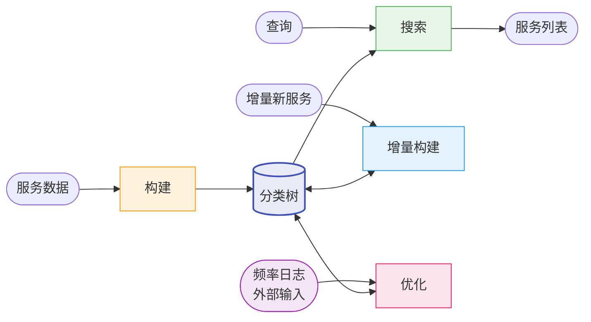
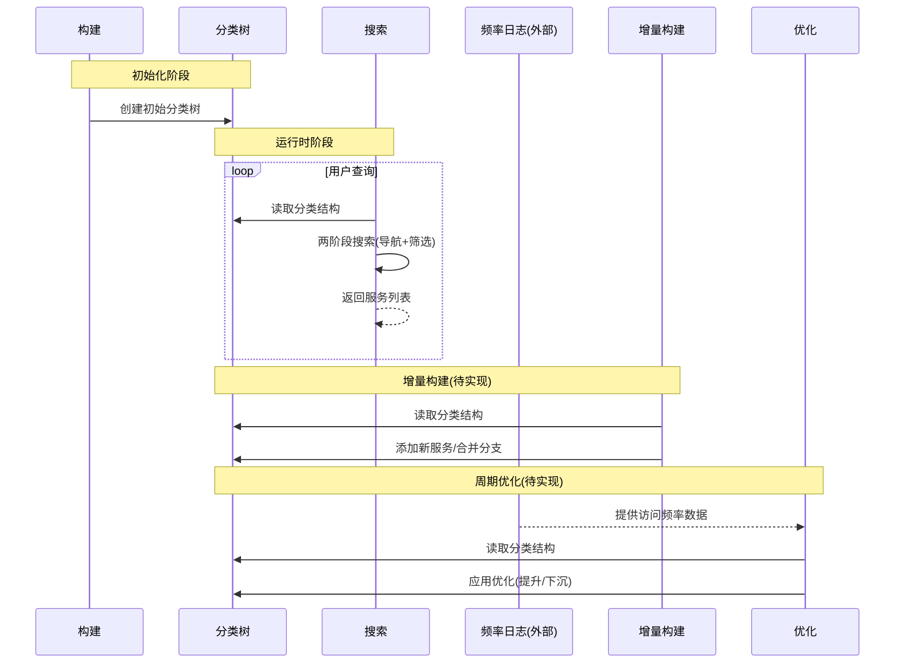
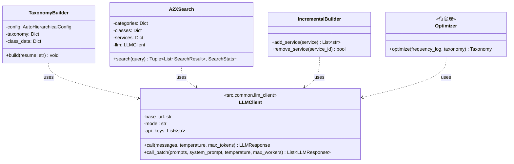

# A2X 系统设计文档

**版本**: v0.1.0

本文档包含系统整体视图。各模块详细设计见：
- 构建模块：[build_design.md](build_design.md)
- 搜索模块：[search_design.md](search_design.md)
- 增量构建模块：[incremental_design.md](incremental_design.md)

---

## 系统整体视图

### 1. 流程逻辑说明

A2X 注册中心由四个模块组成，围绕核心数据结构 **分类树** 协同工作：

1. **构建模块**：从服务列表自动构建层次化分类树（详见 [build_design.md](build_design.md)）
2. **搜索模块**：基于分类树执行两阶段 LLM 递归检索，返回匹配服务
3. **增量构建模块**（待实现）：将增量新服务插入已有分类树，必要时合并分支
4. **优化模块**（待实现）：根据外部输入的频率日志动态调整树结构，降低高频服务的检索成本

**数据流**：
- 构建模块输出分类树 → 搜索模块、增量构建模块、优化模块共同使用
- 增量构建模块和优化模块修改分类树 → 搜索模块读取最新版本
- 频率日志由外部独立提供 → 优化模块消费

### 2. 对外调用接口

| 模块 | 输入 | 输出 | 状态 |
|:----:|:----:|:----:|:----:|
| **构建** | 服务列表 | 分类树（taxonomy.json + class.json） | ✅ |
| **搜索** | 查询 + 分类树 | 服务列表 + 搜索统计 | ✅ |
| **增量构建** | 新服务 + 分类树 | 更新后的分类树 | 待实现 |
| **优化** | 频率日志 + 分类树 | 优化后的分类树 | 待实现 |

### 3. 逻辑视图

### 4. 顺序图

### 5. 类图

