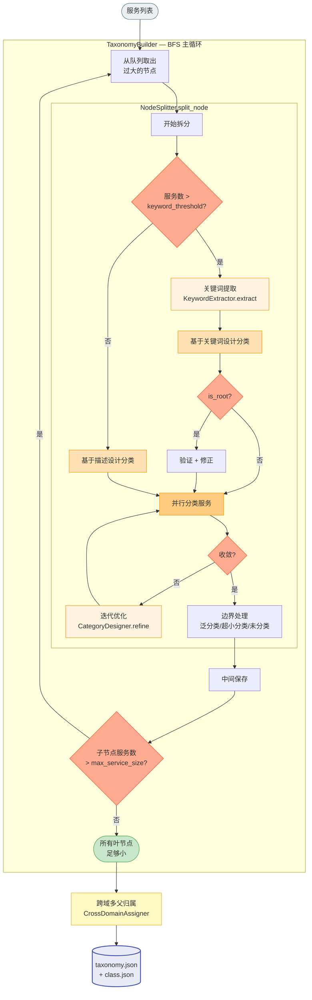
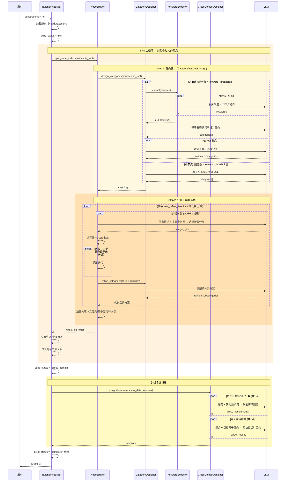
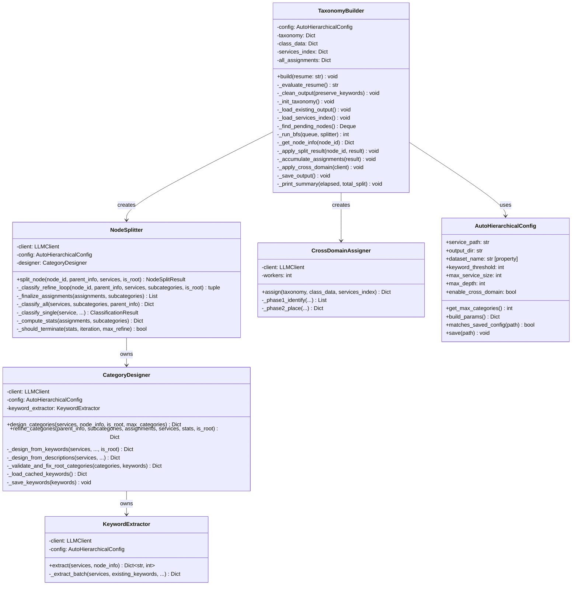

# A2X 构建模块设计文档

**版本**: v0.1.1 (2026-03-23)

本文档详细描述构建模块（`src/a2x/build/`）的设计。系统整体视图及其他模块设计见 [a2x_design.md](a2x_design.md)。

---

## 1. 流程逻辑说明

构建模块是分类树的生产者，负责将一份扁平的服务列表自动转化为层次化分类树（taxonomy.json + class.json），全程由 LLM 驱动，无需人工设计或维护目录结构。

整个构建过程以 **BFS 递归** 为主循环，从根节点开始，逐层拆分过大的节点。每个节点的拆分由 NodeSplitter 编排，包含以下步骤：

1. **分类设计**（CategoryDesigner.design）：根据节点规模自动选择策略——大节点（服务数 > keyword_threshold）先通过 KeywordExtractor 批量提取功能关键词，再基于关键词频率设计分类；小节点直接基于服务描述设计分类。仅 root 节点的关键词会缓存到 keywords.json 供复用，子节点的关键词不保存。Root 节点还会额外经过 LLM 验证和修正。
2. **服务分类**（NodeSplitter._classify_all）：将所有服务并行分配到子分类中（每服务 1 次 LLM 调用）。匹配过多子分类的服务标记为"泛分类"，无法匹配的标记为"未分类"，均留在父节点。
3. **收敛判断**（NodeSplitter._should_terminate）：若无泛分类且无未分类服务，或达到最大迭代次数，则收敛。
4. **迭代优化**（CategoryDesigner.refine）：未收敛时，将分类统计和问题服务反馈给 LLM，调整子分类方案后重新分类。
5. **边界处理**：删除过小的子分类（服务数 ≤ delete_threshold），将其服务归入未分类。

BFS 主循环（TaxonomyBuilder）在每个节点拆分后，将仍然过大的子节点入队继续细分，直至所有叶节点足够小或达到最大深度。每次拆分后立即保存中间结果，支持断点续传。

最后，**跨域多父归属**（CrossDomainAssigner）识别应同时出现在多个功能域的服务，将其链接到其他域的最佳叶分类，提升跨域可发现性。

## 2. 对外调用接口

### CLI 入口

```bash
# 完全重构（output-dir 默认为 src/a2x/data/{数据集名}）
python -m src.a2x.build --service-path database/ToolRet_clean/service.json

# 断点续传（完成则跳过，中断则继续，配置变更则重建）
python -m src.a2x.build --service-path database/ToolRet_clean/service.json --resume yes

# 复用关键词重构（调试用，跳过关键词提取）
python -m src.a2x.build --service-path database/ToolRet_clean/service.json --resume keyword

# 可选参数
# --output-dir path          自定义输出目录（默认 src/a2x/data/{数据集名}）
# --generic-ratio 0.333      泛分类阈值
# --delete-threshold 2       超小子分类删除阈值
# --max-depth 3              最大递归深度（设为 1 可跳过递归细分）
# --no-cross-domain          禁用跨域分配
```

**数据集命名约定**：`service.json` 所在的上级目录名即为数据集名。例如 `database/ToolRet_clean/service.json` → 数据集名 `ToolRet_clean`，默认输出至 `src/a2x/data/ToolRet_clean`。

### Python 接口

```python
from src.a2x.build import AutoHierarchicalConfig, TaxonomyBuilder

config = AutoHierarchicalConfig(
    service_path="your_services.json",
    # output_dir 默认为 "src/a2x/data/{数据集名}"
)

builder = TaxonomyBuilder(config)
builder.build()                    # 完全重构
builder.build(resume="yes")        # 断点续传
builder.build(resume="keyword")    # 复用关键词重构
```

### 配置项（AutoHierarchicalConfig）

```python
@dataclass
class AutoHierarchicalConfig:
    # 路径
    service_path: str = "database/ToolRet_clean/service.json"
    output_dir: str = None   # 默认 "src/a2x/data/{dataset_name}"

    # 关键词提取
    keyword_batch_size: int = 50       # 每批服务数
    max_keywords_per_service: int = 5  # 每个服务最多关键词数

    # 分类设计
    keyword_threshold: int = 500       # 大/小节点设计策略切换阈值
    max_categories_size: int = 20      # 每个节点最多子分类数

    # 分类/精炼
    generic_ratio: float = 1/3         # 泛分类阈值（匹配超过此比例的子分类则为泛分类）
    delete_threshold: int = 2          # 超小子分类删除阈值
    max_refine_iterations: int = 3     # 最大精炼迭代轮数

    # 树结构
    max_service_size: int = 40         # 叶节点最大服务数（超出则入队继续拆分）
    max_depth: int = 3                 # 最大递归深度

    # LLM max_tokens
    max_tokens_design: int = 6000       # 分类设计（关键词 / root 重设计）
    max_tokens_design_small: int = 4000 # 分类设计（描述 / 子节点精炼）
    max_tokens_classify: int = 300      # 单服务分类
    max_tokens_validate: int = 3000     # root 分类验证
    max_tokens_keywords: int = 4000     # 关键词提取（每批）

    # 并行
    workers: int = 20                  # 并行工作线程数

    # 跨域
    enable_cross_domain: bool = True   # 是否启用跨域多父归属
```

### 输入输出格式

**输入** — `service.json`：
```json
[
  {"id": "svc_1", "name": "FlightBooking", "description": "Book flights...", "inputSchema": {...}}
]
```

**输出** — `taxonomy.json`（树结构 + 构建状态）：
```json
{
  "version": "2.0-hierarchical",
  "root": "root",
  "build_status": "complete",
  "categories": {
    "root": {"children": ["cat_travel", "cat_finance"], "services": ["svc_generic"]},
    "cat_travel": {"children": ["cat_flights", "cat_hotels"], "services": []},
    "cat_flights": {"children": [], "services": ["svc_1", "svc_2"]}
  }
}
```

`build_status` 取值：`"bfs"`（BFS 拆分中）、`"cross_domain"`（BFS 完成，跨域待处理）、`"complete"`（构建完成）。

**输出** — `class.json`（分类元数据）：
```json
{
  "version": "2.0-hierarchical",
  "categories": {
    "cat_travel": {
      "name": "Travel & Tourism",
      "description": "Services for booking flights, hotels, and travel planning",
      "boundary": "Not for financial transactions or insurance",
      "decision_rule": "If the service helps users plan or book trips"
    }
  }
}
```

**输出** — `assignments.json`（分配详情，调试用）：
```json
{
  "svc_1": {"category_ids": ["cat_flights"], "reasoning": "Flight booking service"}
}
```

## 3. 逻辑视图



## 4. 顺序图



## 5. 类图


