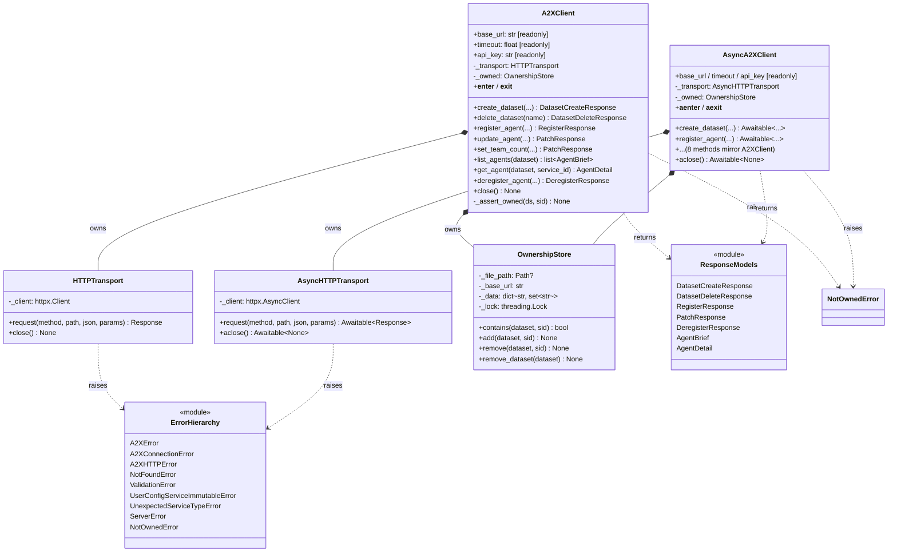
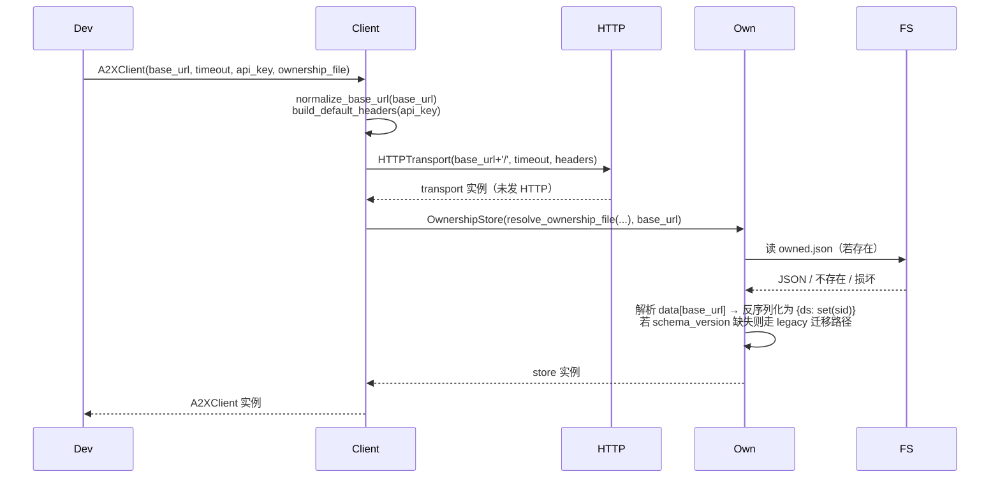
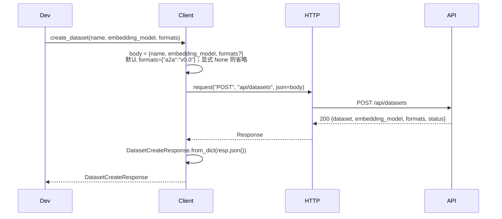
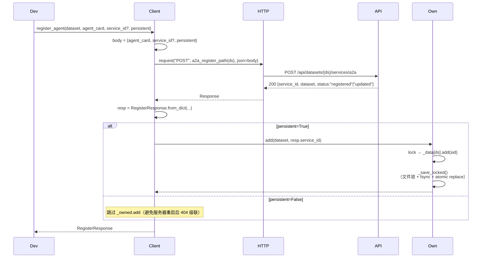
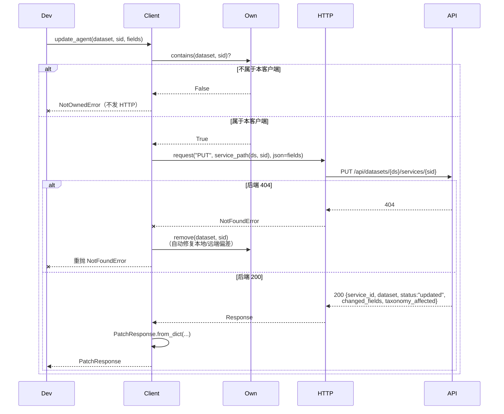
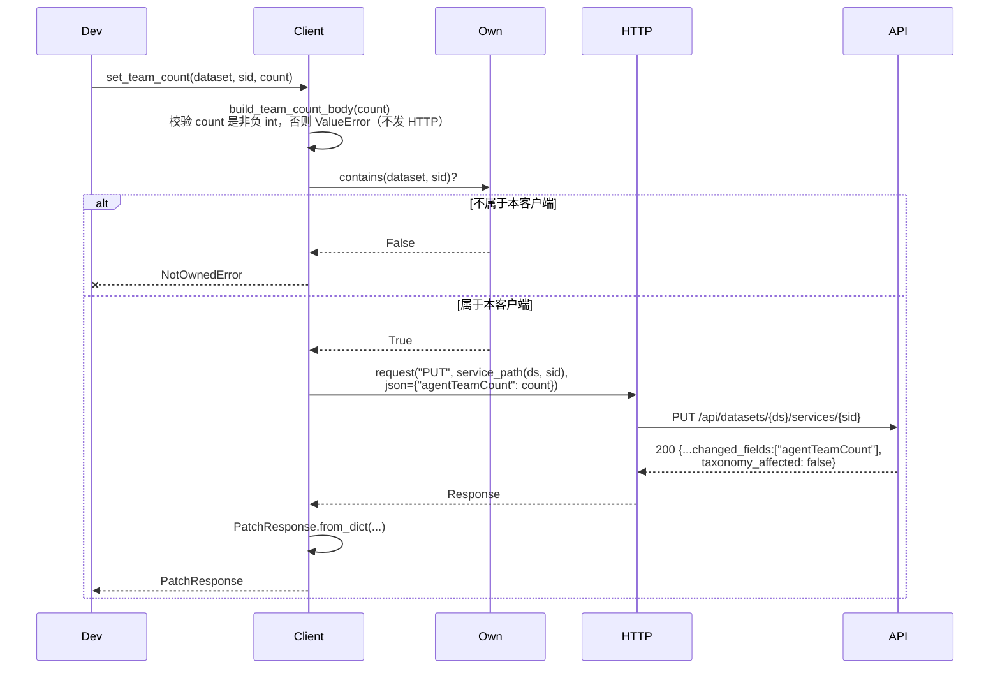
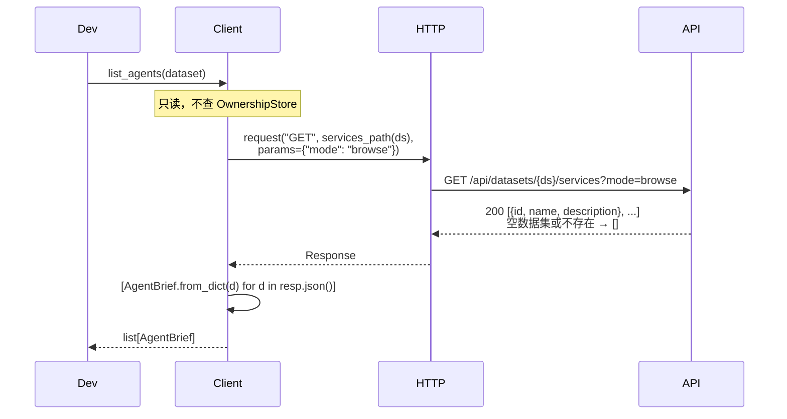
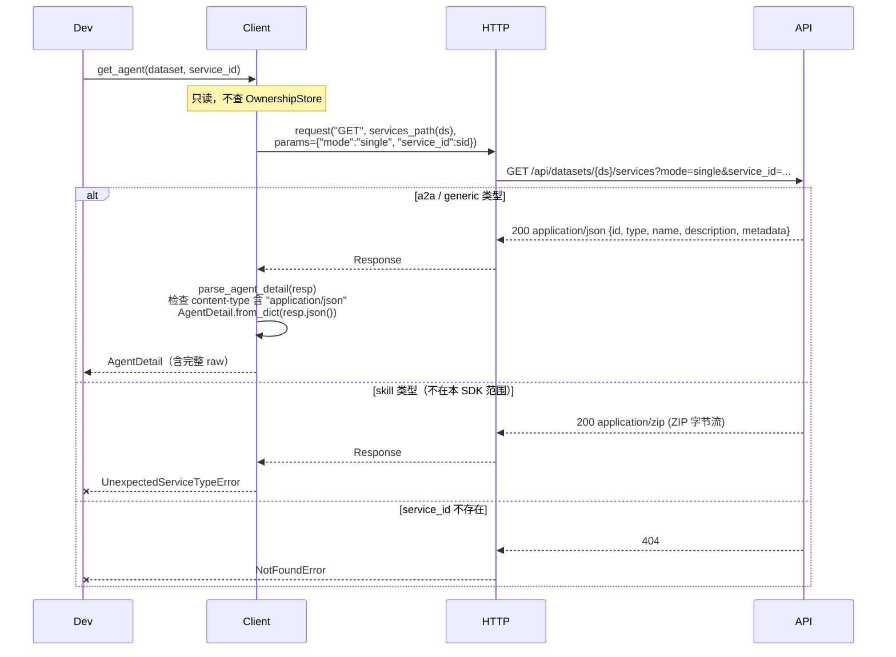
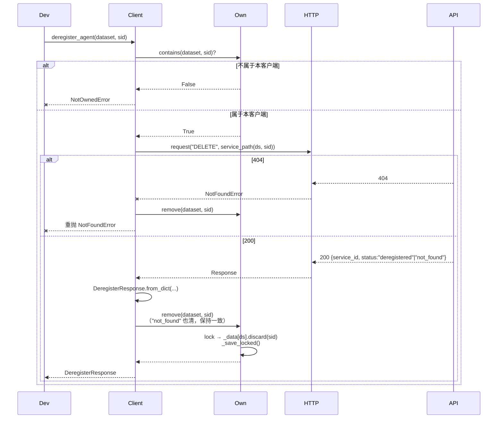

# Client SDK 设计文档

本文档描述 Python 客户端 SDK（`src/client/`）的设计。系统整体视图及其他模块见 [a2x_design.md](a2x_design.md)；后端 HTTP API 规范见 [backend_api.md](backend_api.md)。

## 模块定位

`src/client/` 为开发者提供简化接口，将函数参数翻译为对 A2X Registry FastAPI 后端的 HTTP 请求。

**首要使用场景**：**Agent Team 注册与发现**。开发者将团队中的每个 Agent 以 A2A Agent Card v0.0 格式注册到一个数据集中，通过数据集管理团队成员、更新组队状态、查询成员。

**独立分发约束**：

- SDK 必须**自包含**，不依赖 `src/backend/` / `src/register/` / `src/common/` / `src/a2x/` 等项目内部模块
- 对外依赖仅 `httpx`（及 Python 标准库），Python ≥ 3.10
- 两种使用方式：
  1. 包内使用：`from src.client import A2XClient, AsyncA2XClient`
  2. 独立分发：打包为 `a2x-registry-client` 后 `from a2x_client import A2XClient, AsyncA2XClient`

**同步 + 异步双入口**：

| 入口 | 底层 | 上下文管理 |
|------|------|-----------|
| `A2XClient` | `httpx.Client` | `with A2XClient(...) as c:` |
| `AsyncA2XClient` | `httpx.AsyncClient` | `async with AsyncA2XClient(...) as c:` |

两者**方法签名完全对称**（名称、参数、返回类型、异常层级一致），仅 async 版每个方法以 `async def` 定义、返回 `Awaitable[T]`。

---

## 1. 如何使用

### 1.1 Agent Team 完整流程（同步）

```python
from src.client import A2XClient    # 或: from a2x_client import A2XClient

client = A2XClient(base_url="http://127.0.0.1:8000")

# ① 创建团队数据集（默认锁定仅接受 A2A v0.0 格式）
client.create_dataset("research_team")

# ② 注册团队成员（Agent Card v0.0 最小字段：name + description）
planner = client.register_agent("research_team", {
    "protocolVersion": "0.0",
    "name": "Task Planner",
    "description": "拆解复杂任务为可执行子任务",
})

researcher = client.register_agent("research_team", {
    "protocolVersion": "0.0",
    "name": "Web Researcher",
    "description": "基于关键词检索网页并摘要",
    "skills": [
        {"name": "search", "description": "搜索互联网"},
        {"name": "summarize", "description": "提炼关键信息"},
    ],
})

# ③ 初始化组队状态字段（可选）
client.set_team_count("research_team", planner.service_id, 0)
client.set_team_count("research_team", researcher.service_id, 0)

# ④ 部分字段更新（顶层 upsert，未列出字段保持不变）
client.update_agent(
    dataset="research_team",
    service_id=researcher.service_id,
    fields={"description": "检索 + 摘要 + 多语种翻译"},
)

# ⑤ 实际组队时更新 count
client.set_team_count("research_team", planner.service_id, 2)
client.set_team_count("research_team", researcher.service_id, 2)

# ⑥ 列出成员
for brief in client.list_agents("research_team"):
    print(brief.id, "-", brief.name, ":", brief.description)

# ⑦ 查询某成员完整信息（含自定义字段）
detail = client.get_agent("research_team", planner.service_id)
print(detail.name, "team count:", detail.metadata.get("agentTeamCount"))

# ⑧ 注销成员
client.deregister_agent("research_team", researcher.service_id)

# ⑨ 清理数据集
client.delete_dataset("research_team")

client.close()
```

### 1.2 异步等价流程

```python
import asyncio
from src.client import AsyncA2XClient

async def main():
    async with AsyncA2XClient(base_url="http://127.0.0.1:8000") as client:
        await client.create_dataset("research_team")

        planner = await client.register_agent("research_team", {
            "protocolVersion": "0.0", "name": "Planner", "description": "d",
        })
        researcher = await client.register_agent("research_team", {
            "protocolVersion": "0.0", "name": "Researcher", "description": "d",
        })

        # 并发初始化 team count
        await asyncio.gather(
            client.set_team_count("research_team", planner.service_id, 0),
            client.set_team_count("research_team", researcher.service_id, 0),
        )

        # 并发查询所有成员详情
        details = await asyncio.gather(
            client.get_agent("research_team", planner.service_id),
            client.get_agent("research_team", researcher.service_id),
        )
        for d in details:
            print(d.name, "team count:", d.metadata.get("agentTeamCount"))

        await client.delete_dataset("research_team")

asyncio.run(main())
```

**何时选异步**：并发注册/查询多个 Agent（如 Agent Team 初始化），或集成到已有的 asyncio / FastAPI / aiohttp 应用时。其余场景同步版足够。

### 1.3 初始化参数

```python
A2XClient(
    base_url: str = "http://127.0.0.1:8000",
    timeout: float = 30.0,
    api_key: str | None = None,
    ownership_file: Path | str | Literal[False] | None = None,
)
```

| 参数 | 说明 |
|------|------|
| `base_url` | 后端地址。**自动补尾 `/`**，以支持挂载在子路径下的后端（如 `http://host/a2x/`） |
| `timeout` | HTTP 超时（秒） |
| `api_key` | 非空时自动添加请求头 `Authorization: Bearer <api_key>` |
| `ownership_file` | `None` → 默认 `~/.a2x_client/owned.json`；`False` → 禁用持久化仅内存；`Path`/`str` → 自定义路径 |

构造函数不发任何 HTTP 请求；`base_url` / `timeout` / `api_key` 以**只读 property** 暴露，运行时改写不会生效。

### 1.4 所有权约束

SDK 维护 `_owned: {dataset: {service_id}}`，记录**本客户端注册过的服务**。只允许更新/注销自己注册的服务，从而避免误改他人。

| method | 写入 `_owned` | 校验 `_owned` |
|--------|:------------:|:------------:|
| `register_agent(..., persistent=True)` | ✅ 成功后加入 | — |
| `register_agent(..., persistent=False)` | — （跳过，避免服务器重启后的 404 级联） | — |
| `update_agent` | — | ✅ 不属于本客户端 → `NotOwnedError`（**不发 HTTP**） |
| `set_team_count` | — | ✅ 同上 |
| `deregister_agent` | 成功后移除 | ✅ 同上 |
| `delete_dataset` | 成功/400 均移除该数据集整段 | — |
| `list_agents` / `get_agent` / `create_dataset` | — | — （只读或跨所有权） |

**自动同步本地与远端**：

- 任一 mutation 命中后端 404 → SDK 自动从 `_owned` 移除该 `service_id` 再重抛 `NotFoundError`（避免本地缓存与后端永久偏差）
- `delete_dataset` 命中 400（数据集早被删）→ 也清本地再重抛 `ValidationError`

### 1.5 持久化：`owned.json`

默认存于 `~/.a2x_client/owned.json`，**每次变更后立即原子写盘**。支持同一开发者连接多个后端：

```json
{
  "schema_version": 1,
  "data": {
    "https://registry.example.com/": {
      "research_team": ["agent_planner_xxx", "agent_researcher_yyy"]
    },
    "http://127.0.0.1:8000/": {
      "test_team": ["agent_test_zzz"]
    }
  }
}
```

**并发安全**：

- **跨进程**：`owned.json.lock` 兄弟文件持锁（POSIX `fcntl.flock`、Windows `msvcrt.locking`），保护整个 read-modify-write
- **同进程**：`threading.Lock` 串行化所有 mutation
- **掉电安全**：`fsync(tmp)` → `os.replace(tmp, final)`，保证永远不会留下半写入文件
- **I/O 失败降级**：磁盘满等 OSError 降级为 `warnings.warn`——HTTP 已成功时若抛异常会诱导调用方重试，反而在后端制造重复

**向后兼容**：旧格式（无 `schema_version` 的扁平 `{base_url: {...}}`）读取时静默迁移为 v1。

### 1.6 异常体系

```
A2XError                                基类，携带 status_code + payload
├── A2XConnectionError                 网络 / 超时
├── A2XHTTPError                       4xx/5xx 通用
│   ├── NotFoundError                 404
│   ├── ValidationError               400 / 422
│   │   └── UserConfigServiceImmutableError   user_config 来源服务不可改
│   ├── UnexpectedServiceTypeError    get_agent 收到非 JSON（如 skill ZIP）
│   └── ServerError                   5xx
└── NotOwnedError                      本地所有权校验失败，未发 HTTP
```

> `UserConfigDeregisterForbiddenError` 作为 `UserConfigServiceImmutableError` 的别名保留，兼容旧代码。

常见处理示例：

```python
from src.client import (
    A2XClient, NotOwnedError, NotFoundError,
    ValidationError, A2XConnectionError,
)

try:
    client.update_agent("ds", sid, {"description": "x"})
except NotOwnedError:
    ...  # 本地 fail-fast，sid 不是本 client 注册的
except NotFoundError:
    ...  # 后端已找不到该 service（本地 _owned 已自动清理）
except ValidationError as e:
    ...  # 字段校验失败、user_config 来源等；e.payload 含细节
except A2XConnectionError:
    ...  # 网络层失败
```

### 1.7 幂等性建议

`register_agent` 省略 `service_id` 时由后端生成 ID。**若调用返回失败但服务已在后端创建**（响应在网络上丢失），重试会产生孤儿服务。

需要 retry-safe 行为的调用方应**显式传入 `service_id`**（例如 UUID），重试将变为等价的"重注册 → status=updated"，不会产生重复：

```python
import uuid
sid = f"agent_{uuid.uuid4().hex}"
client.register_agent("team", card, service_id=sid)   # 重试同 sid 幂等
```

---

## 2. 整体架构

### 2.1 模块划分

```
src/client/
├── __init__.py          # 导出 A2XClient / AsyncA2XClient / 异常 / dataclass
├── client.py            # A2XClient（同步入口）
├── async_client.py      # AsyncA2XClient（异步入口，镜像同步）
├── transport.py         # HTTPTransport + AsyncHTTPTransport
├── ownership.py         # OwnershipStore（同步文件 I/O + 跨进程锁）
├── _internal.py         # 共享纯函数（URL / body / 哨兵 / header 构造）
├── models.py            # 响应 dataclass（from_dict 容忍未知字段）
├── errors.py            # 异常层级
├── tests/               # pytest 单元测试（不纳入 wheel）
├── py.typed             # PEP 561 类型标记
├── pyproject.toml       # 独立打包时用
└── README.md
```

**独立性自检**：`grep -r "from src\." src/client/ | grep -v "from src\.client"` 应无命中。

### 2.2 类图



### 2.3 模块职责表

| 模块 | 职责 | 依赖 |
|------|------|------|
| `client.py` / `async_client.py` | **业务编排**：参数组装、所有权前置检查、响应反序列化、404/400 自动清理 | `_internal` / `transport` / `ownership` / `models` / `errors` |
| `transport.py` | **HTTP 出口**：唯一网络出口；2xx 返回 `httpx.Response`；4xx/5xx 通过共享 `_wrap_http_error` 映射为 `A2XError` 子类；网络/超时异常映射为 `A2XConnectionError` | `httpx` / `errors` |
| `ownership.py` | **本地状态 + 持久化**：内存维护 `{ds: {sid}}`；每次变更在跨平台文件锁下 atomic write；I/O 失败降级为 warning | `stdlib` only |
| `_internal.py` | **共享纯函数**：URL 构造、body 构造、`UNSET` 哨兵、ownership-file 解析、header 构造、`parse_agent_detail`。让同步/异步两个入口类不用共享基类也能复用逻辑 | `httpx` (type hint only) / `errors` / `models` |
| `models.py` | **响应映射**：每个后端端点对应一个 `@dataclass`；`from_dict` 容忍未知字段；`AgentDetail.raw` 保留完整原 dict | `stdlib` only |
| `errors.py` | **异常层级**：基类 `A2XError` 携带 `status_code` / `payload`；HTTP 类与本地类分两支 | `stdlib` only |

**职责边界**：

- `client.py` 不直接用 `httpx`、不做文件 I/O（分别委托给 transport / ownership）
- `transport.py` 不知道"所有权"、"data model"（只管 HTTP 和错误映射）
- `ownership.py` 不知道"后端"、"HTTP"（只管 JSON 文件持久化）

---

## 3. 对外接口 → 内部调用时序图

共 9 个对外接口（含 `__init__`）。以下时序图同步/异步通用，**差异仅在**：

- 异步版中 `Client → HTTP` 所有调用前加 `await`，HTTP 走 `httpx.AsyncClient`
- 异步版中 `Client → Own` 的**写入**（`add`/`remove`/`remove_dataset`）通过 `await asyncio.to_thread(...)` 调度；只读 `contains` 仍同步
- 异步版调用方使用 `await client.method(...)`

图例：
- `Dev` — 开发者代码
- `Client` — `A2XClient` / `AsyncA2XClient`
- `Own` — `OwnershipStore`
- `HTTP` — `HTTPTransport` / `AsyncHTTPTransport`
- `API` — FastAPI 后端
- `FS` — 本地文件系统

### 3.1 `__init__`

不发 HTTP，仅建连接池 + 从磁盘恢复所有权。



### 3.2 `create_dataset`



### 3.3 `register_agent`



### 3.4 `update_agent`



### 3.5 `set_team_count`



> 404 分支与 `update_agent` 相同——自动清本地再重抛。图略。

### 3.6 `list_agents`



### 3.7 `get_agent`



### 3.8 `deregister_agent`



> 后端 `status:"not_found"` 仍返回 200，SDK 同样从 `_owned` 移除。

### 3.9 `delete_dataset`

```mermaid
sequenceDiagram
    participant Dev
    participant Client
    participant HTTP
    participant API
    participant Own

    Dev->>Client: delete_dataset(name)
    Note over Client: 数据集层面无创建者追踪，不做所有权检查
    Client->>HTTP: request("DELETE", dataset_path(name))

    alt 200
        API-->>HTTP: 200 {dataset, status:"deleted"}
        HTTP-->>Client: Response
        Client->>Client: DatasetDeleteResponse.from_dict(...)
        Client->>Own: remove_dataset(name)
        Own->>Own: _data.pop(name); _save_locked()
        Client-->>Dev: DatasetDeleteResponse
    else 400（数据集早已不存在）
        API-->>HTTP: 400 {detail:"... does not exist"}
        HTTP--xClient: ValidationError
        Client->>Own: remove_dataset(name)<br/>（避免"永远 400 + 永远残留"）
        Client--xDev: 重抛 ValidationError
    end
```

---

## 4. 后端 API 对照

| SDK 方法 | HTTP | 端点 | 关键行为 |
|---------|------|------|---------|
| `create_dataset` | `POST` | `/api/datasets` | 默认 `formats={"a2a":"v0.0"}` |
| `register_agent` | `POST` | `/api/datasets/{ds}/services/a2a` | `agent_card` dict 整体透传；成功后按 `persistent` 选择性入 `_owned` |
| `update_agent` | `PUT` | `/api/datasets/{ds}/services/{sid}` | `fields` dict 作为 body；顶层字段 upsert；404 自动清 `_owned` |
| `set_team_count` | `PUT` | 同上 | body 固定为 `{"agentTeamCount": count}`；count 本地校验 |
| `list_agents` | `GET` | `/api/datasets/{ds}/services?mode=browse` | 空数据集/不存在 → `[]` |
| `get_agent` | `GET` | `/api/datasets/{ds}/services?mode=single&service_id=...` | content-type 分支：JSON → AgentDetail；ZIP → `UnexpectedServiceTypeError` |
| `deregister_agent` | `DELETE` | `/api/datasets/{ds}/services/{sid}` | 200 `"not_found"` 与 `"deregistered"` 同路径处理；成功后清 `_owned` |
| `delete_dataset` | `DELETE` | `/api/datasets/{ds}` | 200 和 400 都清 `_owned[name]` |

**参数转换通用规则**：

| 规则 | 说明 |
|------|------|
| URL path | 路径段由 `urllib.parse.quote(segment, safe="")` 显式 URL-encode；路径**不以 `/` 开头**，依赖 `base_url` 结尾的 `/` 拼接 |
| `None` 字段过滤 | body 组装时剔除值为 `None` 的键 |
| Agent Card 透传 | `agent_card` / `fields` dict 整体作为 body，**不做字段重命名**（保留 camelCase 如 `protocolVersion`） |
| 所有权 fail-fast | 本地校验失败抛 `NotOwnedError`，不发 HTTP |
| HTTP 错误 | 4xx/5xx 通过 `_wrap_http_error` 映射为 `A2XError` 子类 |
| JSON 反序列化 | dataclass `from_dict` 工厂容忍多余字段；`AgentDetail.raw` 保留原始响应 |

---

## 5. 测试

单元测试位于 `src/client/tests/`，用 `pytest` + `pytest-asyncio` + `httpx.MockTransport` 驱动，**不需要真实后端**。

```bash
pip install pytest pytest-asyncio
python -m pytest src/client/tests/
```

覆盖范围：

| 测试文件 | 覆盖对象 |
|---------|----------|
| `test_internal.py` | body 构造、URL 编码、`UNSET` 哨兵、ownership-file 解析、header 构造 |
| `test_ownership.py` | 读写、v0/v1 schema 迁移、损坏文件容忍、多 base_url 隔离、线程并发、`_save` 失败降级为 warning、掉电原子性（无残留 tmp） |
| `test_transport.py` | 状态码 → 异常映射、`user_config` 分支、连接异常、body/params 转发 |
| `test_client.py` | 8 个对外方法的完整路径；持久化开关、所有权 fail-fast、404 自清、400 自清、子路径 base_url 正确拼接 |
| `test_async_client.py` | 异步版对等行为子集（确认同步/异步对称） |

打包时测试不纳入 wheel：`pyproject.toml` 的 `packages = ["a2x_client"]` 只导出顶层，`tests/` 子目录不会被 setuptools 递归收集。

---

## 6. 扩展预留

- **register-config 管理**：后端 `GET/POST /api/datasets/{ds}/register-config` 可管理允许格式。如需支持，加 `get_register_config(ds)` / `set_register_config(ds, formats)`（同步 + 异步双份）
- **其他端点**：generic 服务注册、skill 上传、模糊检索（`POST /api/search`）、构建（`build.*`）、SSE/WebSocket — 按相同模式扩展，每个方法同时加到 `A2XClient` 和 `AsyncA2XClient`
- **URL 模式注册**：`register_agent_from_url(agent_card_url)` 对应后端的 `agent_card_url` 入参
