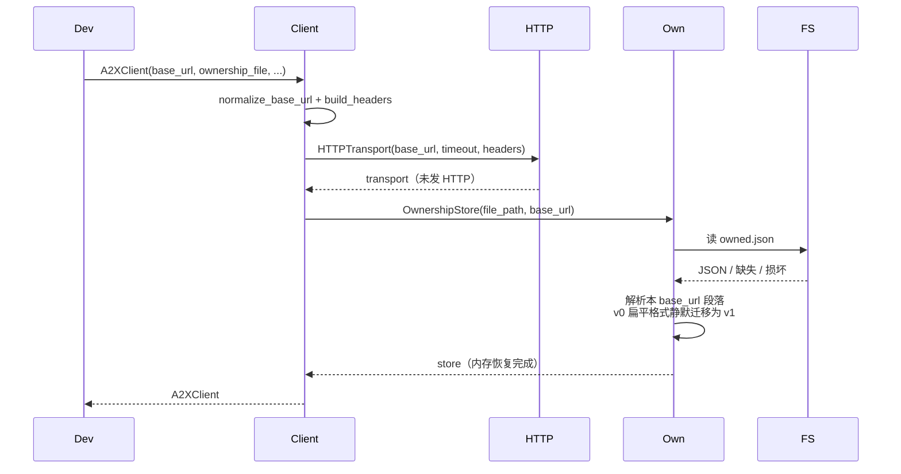
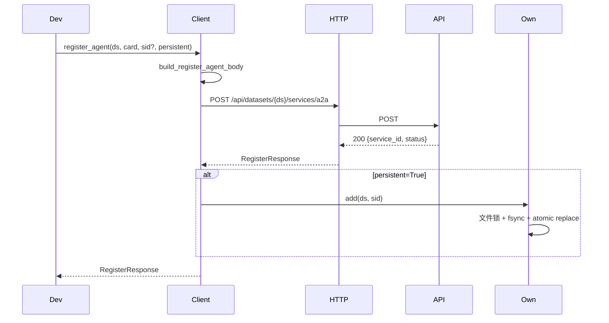
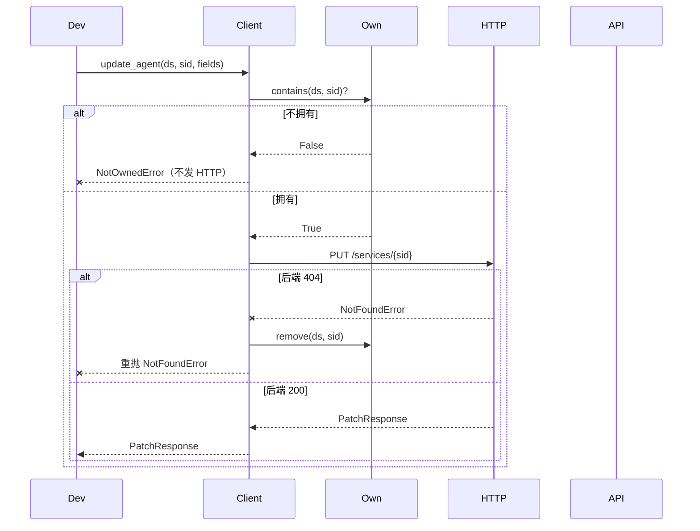
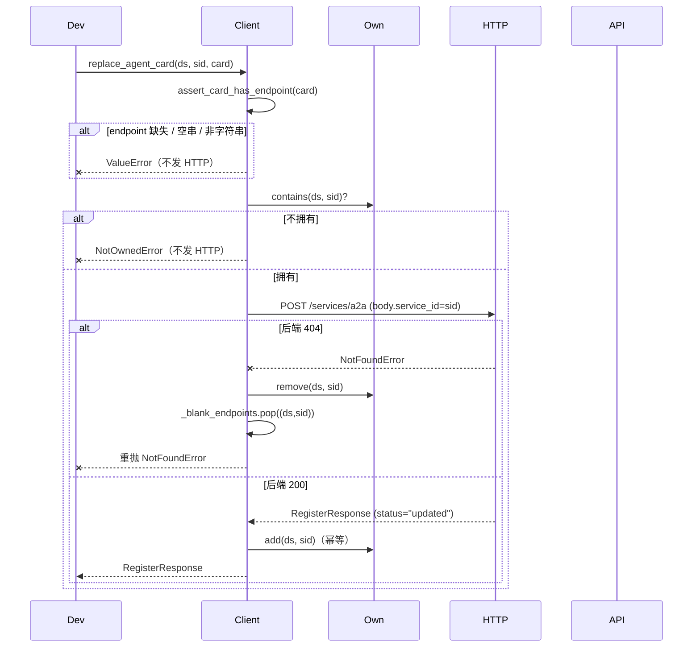
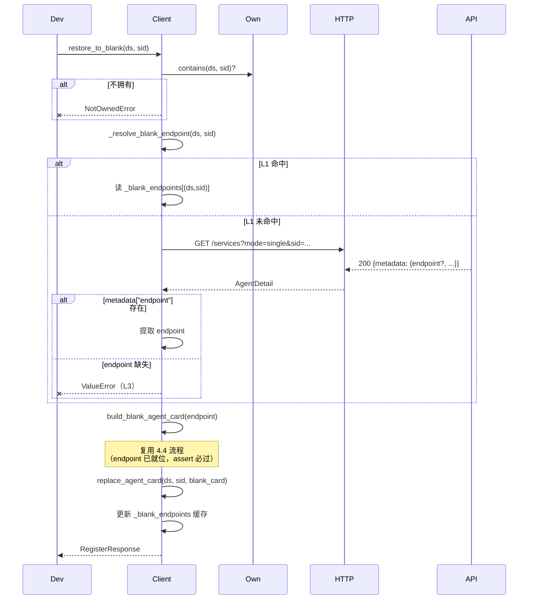
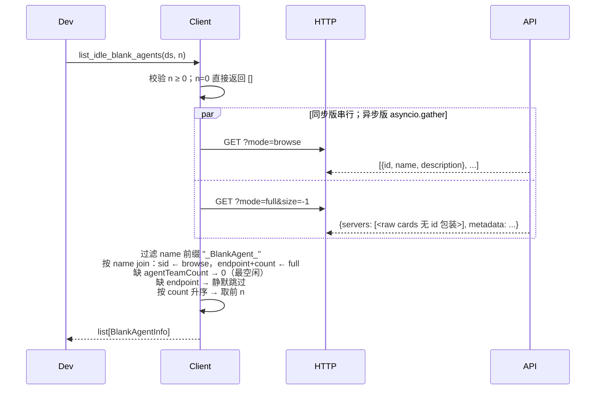

# Client SDK 设计文档

## 1. 整体介绍

`src/client/` 是 A2X Registry 的 Python 客户端 SDK，把对 FastAPI 后端的 HTTP 请求包装成类型清晰、幂等安全的方法。

**首要场景**：**Agent Team 动态组队** —— 每个 Agent 以"空白 agent"身份进入空闲池；另一个 Agent 发现它们、发起 P2P 组队；组队期间各自更新 card 的 `agentTeamCount`；解散后恢复空白。SDK 提供 blank 注册 / 空闲发现 / 整体覆盖 / 恢复空白 4 个团队原语。

**同步 + 异步双入口**：

| 入口 | 底层 |
|------|------|
| `A2XClient` | `httpx.Client` |
| `AsyncA2XClient` | `httpx.AsyncClient` |

方法名、参数、返回类型、异常体系完全对称；async 版每个方法以 `async def` 定义，关闭方法为 `aclose()`。

**独立分发约束**：SDK 自包含，仅依赖 `httpx`（Python ≥ 3.10），不引用项目其他模块。`from src.client import ...` 或打包后 `from a2x_client import ...` 均可。

---

## 2. 如何使用

### 2.1 经典流程代码

Agent A 入池 → Agent B 发现并发起 P2P 组队 → A 更新 card → 解散后 A 恢复空白：

```python
from src.client import A2XClient, BlankAgentInfo

client = A2XClient(base_url="http://127.0.0.1:8000")
client.create_dataset("team_pool")    # 初始化（只做一次）

# ── ① Agent A: 作为空白 agent 入池 ─────────────────────────────
resp = client.register_blank_agent("team_pool", endpoint="http://a.example:8080")
sid_a = resp.service_id

# ── ② Agent B: 取 N 个最空闲的 blank agent ──────────────────────
idle: list[BlankAgentInfo] = client.list_idle_blank_agents("team_pool", n=3)
# 每条含 service_id / endpoint / agent_team_count（按 count 升序）

# ── ③ B 选中 A，向 A 的 endpoint 直接发起 P2P 组队请求（绕过注册中心）
#       A 收到后同意                                              ──

# ── ④ A 覆盖自己的 card，team count 置 1 ───────────────────────
client.replace_agent_card("team_pool", sid_a, {
    "name": "Task Planner (team-1)",
    "description": "负责拆解任务",
    "endpoint": "http://a.example:8080",   # 必须保留；SDK 本地校验
    "agentTeamCount": 1,
    "skills": [{"name": "plan", "description": "子任务拆解"}],
})

# ── ⑤ B 协作完成，向 A 发起 P2P 解散请求，A 同意 ─────────────────

# ── ⑥ A 恢复为空白，team count 归 0 ─────────────────────────────
client.restore_to_blank("team_pool", sid_a)
# endpoint 从 L1 内存缓存取，无额外 HTTP

client.close()
```

**异步版**：把 `A2XClient` 换成 `AsyncA2XClient`，方法前加 `await` 即可（或 `async with AsyncA2XClient(...) as client:`）。

### 2.2 全部 method 解释

`A2XClient` 共 15 个对外方法（含 `__init__` 与 `close`）。`AsyncA2XClient` **一对一镜像**，仅 `close` → `aclose`、调用形式改为 `await client.method(...)`；方法名、参数、返回类型、异常一致。下文仅列同步版。

**通用异常**（每个方法都可能发生，不重复列出）：
- `A2XConnectionError` — 网络 / 超时
- `A2XError` — 基类兜底

完整异常层级：

```
A2XError
├── A2XConnectionError                网络 / 超时
├── A2XHTTPError                      4xx/5xx 通用
│   ├── NotFoundError                 404
│   ├── ValidationError               400 / 422
│   │   └── UserConfigServiceImmutableError   user_config 来源不可改
│   ├── UnexpectedServiceTypeError    get_agent 收到非 JSON（skill ZIP）
│   └── ServerError                   5xx
└── NotOwnedError                     本地所有权校验失败，未发 HTTP
```

#### 2.2.1 A2XClient

---

##### `__init__(base_url, timeout, api_key, ownership_file)`

构造客户端。不发 HTTP，仅建连接池 + 从磁盘恢复 `_owned`。

| 参数 | 类型 | 默认 | 说明 |
|------|------|------|------|
| `base_url` | `str` | `"http://127.0.0.1:8000"` | 自动补尾斜杠，支持子路径挂载 |
| `timeout` | `float` | `30.0` | HTTP 超时（秒） |
| `api_key` | `str \| None` | `None` | 非空时加请求头 `Authorization: Bearer ...` |
| `ownership_file` | `Path \| str \| False \| None` | `None` | `None`=`~/.a2x_client/owned.json`；`False`=仅内存；其他=显式路径 |

**返回**：`A2XClient`
**错误**：无（磁盘读失败降级为 warning）

---

##### `create_dataset(name, embedding_model, formats)`

创建数据集。SDK 默认 `formats={"a2a":"v0.0"}`（Agent Team 场景）；显式传 `None` 则省略，由后端三种类型全开。

**输入**：
- `name: str`
- `embedding_model: str = "all-MiniLM-L6-v2"`
- `formats: dict | None` — 允许的注册格式；省略走 SDK 默认

**返回**：`DatasetCreateResponse(dataset, embedding_model, formats, status)`
**错误**：`ValidationError`（名字非法 / formats 规范化后为空）

---

##### `delete_dataset(name)`

删除数据集全部数据。成功或 400（已不存在）都会清本地 `_owned[name]`。

**输入**：`name: str`
**返回**：`DatasetDeleteResponse(dataset, status)`
**错误**：`ValidationError`（数据集不存在）

---

##### `register_agent(dataset, agent_card, service_id=None, persistent=True)`

注册 A2A Agent。`agent_card` dict 整体透传后端。`persistent=True` 时成功后写入 `_owned`。

**输入**：
- `dataset: str`
- `agent_card: dict` — 至少含 `name` + `description`
- `service_id: str | None` — 省略由后端 `generate_service_id("agent", name)` 派生（SHA256 前 16 hex）
- `persistent: bool = True`

**返回**：`RegisterResponse(service_id, dataset, status)`，`status ∈ {"registered","updated"}`
**错误**：`ValidationError`（card 格式校验失败 / 数据集不存在 / 该类型未允许）

---

##### `update_agent(dataset, service_id, fields)`

部分字段更新（PUT 顶层 upsert，**只增不减**）。

**输入**：
- `dataset: str`
- `service_id: str`
- `fields: dict` — 任意 `{field: value}`

**返回**：`PatchResponse(service_id, dataset, status, changed_fields, taxonomy_affected)`
**错误**：
- `NotOwnedError` — sid 不属于本客户端（本地 fail-fast，**不发 HTTP**）
- `NotFoundError` — 后端 404；自动清 `_owned` 后重抛
- `ValidationError` — 未知字段 / 改名冲突
- `UserConfigServiceImmutableError` — 服务源于 `user_config.json`

---

##### `set_team_count(dataset, service_id, count)`

把 `agentTeamCount` 置为指定非负整数。

**输入**：
- `dataset: str`
- `service_id: str`
- `count: int ≥ 0`

**返回**：`PatchResponse`，`changed_fields=["agentTeamCount"]`，`taxonomy_affected=False`
**错误**：
- `ValueError` — count 非法（本地）
- `NotOwnedError` / `NotFoundError` — 同 `update_agent`

---

##### `list_agents(dataset)`

轻量列表（`mode=browse`）：返回数据集**全部**服务，但每行只含 3 个字段。

**输入**：`dataset: str`
**返回**：`list[AgentBrief(id, name, description)]`
**错误**：无（空数据集或不存在均返回 `[]`）

---

##### `get_agent(dataset, service_id)`

单个服务完整信息（`mode=single`）。

**输入**：
- `dataset: str`
- `service_id: str`

**返回**：`AgentDetail(id, type, name, description, metadata, raw)` — `metadata` 是完整 Agent Card，`raw` 保留原始响应
**错误**：
- `NotFoundError` — sid 不存在
- `UnexpectedServiceTypeError` — 服务是 skill 类型（后端返回 ZIP）

---

##### `deregister_agent(dataset, service_id)`

注销服务。成功后清本地 `_owned` + L1 endpoint 缓存。

**输入**：
- `dataset: str`
- `service_id: str`

**返回**：`DeregisterResponse(service_id, status)`，`status ∈ {"deregistered","not_found"}`
**错误**：
- `NotOwnedError` — 本地未拥有
- `NotFoundError` — 后端 404（自动清本地后重抛）

---

##### `register_blank_agent(dataset, endpoint, service_id=None, persistent=True)`

薄壳于 `register_agent`，构造 blank 模板：

```json
{"name": "_BlankAgent_<endpoint>", "description": "_", "endpoint": "<endpoint>", "agentTeamCount": 0}
```

成功后把 `(dataset, sid) → endpoint` 写入 L1 内存缓存，供 `restore_to_blank` 使用。同 endpoint 重复注册幂等（sid 基于 name 的 SHA256）。

**输入**：
- `dataset: str`
- `endpoint: str` — 非空字符串
- `service_id: str | None`
- `persistent: bool = True`

**返回**：`RegisterResponse(service_id, dataset, status)`
**错误**：
- `ValueError` — endpoint 空/非字符串（本地）
- `ValidationError` — 同 `register_agent`

---

##### `list_agents_full(dataset, page=1, size=-1)`

整库完整元数据（`mode=full`）。

**后端行为提醒**：对 a2a 条目，后端直接返回 Agent Card 本体（无 `id` 包装，见 [`src/backend/routers/dataset.py:232`](../src/backend/routers/dataset.py)）；对 generic/skill 保留 `{id, type, name, description, metadata}` 外壳。所以返回的 `AgentDetail.id` 对 a2a **总是空串**，需要从 `.raw` 读 card；对 generic/skill 正常。

**输入**：
- `dataset: str`
- `page: int = 1` — 1-indexed，`size > 0` 时生效
- `size: int = -1` — `-1` 返回全部；否则 `≥ 1`

**返回**：`list[AgentDetail]`
**错误**：`ValueError` — page/size 非法（本地）

---

##### `list_idle_blank_agents(dataset, n)`

返回最空闲的 N 个空白 agent，按 `agentTeamCount` 升序。内部两次 HTTP：`mode=browse`（拿 sid）+ `mode=full`（拿 endpoint + count），按 `name` 联表。异步版用 `asyncio.gather` 并发。

筛选规则：
- 只收 `name` 以 `_BlankAgent_` 开头的
- 缺 `agentTeamCount` 视为 0（最空闲）
- 缺 `endpoint` 的静默跳过（不符契约）

**输入**：
- `dataset: str`
- `n: int ≥ 0`

**返回**：`list[BlankAgentInfo(service_id, endpoint, agent_team_count)]`
**错误**：`ValueError` — n 非法（本地）

---

##### `replace_agent_card(dataset, service_id, agent_card)`

**整张覆盖** agent card（POST `/services/a2a` 同 sid → `_do_register` 全量替换 entry）。区别于 `update_agent` 的"只增不减"。

本地校验顺序（都 fail-fast，**不发 HTTP**）：
1. `agent_card["endpoint"]` 必须非空字符串 —— 保证 `restore_to_blank` 的 L2 回退可用
2. `service_id` 必须属于本客户端

**输入**：
- `dataset: str`
- `service_id: str`
- `agent_card: dict` — 必含非空 `endpoint`

**返回**：`RegisterResponse(service_id, dataset, status="updated")`
**错误**：
- `ValueError` — card 无 `endpoint`（本地，先于 ownership 校验）
- `NotOwnedError` — sid 不属于本客户端（本地）
- `NotFoundError` — 后端 404；自动清本地后重抛
- `ValidationError` — 后端 card 格式校验失败

---

##### `restore_to_blank(dataset, service_id)`

恢复为空白 agent（= 用 blank 模板调 `replace_agent_card`）。Endpoint 三层回退：

| 层级 | 数据源 | 何时命中 |
|------|--------|----------|
| L1 | 进程内缓存 `_blank_endpoints[(ds,sid)]` | 同进程 register → replace → restore，**0 次额外 HTTP** |
| L2 | `get_agent` 读 `metadata["endpoint"]` | 进程重启 / 缓存清空；依赖上游调用方在 replace 时保留 endpoint |
| L3 | `ValueError` | card 丢失 `endpoint` 字段（契约违反） |

**输入**：
- `dataset: str`
- `service_id: str`

**返回**：`RegisterResponse`
**错误**：
- `NotOwnedError` — 本地未拥有
- `ValueError` — L3 触发
- `NotFoundError` — L2 的 GET 或最终 POST 时 404

---

##### `close()` / `__enter__` / `__exit__`

关闭底层 `httpx.Client` 连接池。支持上下文管理器：

```python
with A2XClient(...) as client:
    client.register_blank_agent(...)
# 退出时自动 close()
```

异步版对应 `aclose()` + `__aenter__` / `__aexit__`。

---

## 3. 整体架构

### 3.1 模块划分

```
src/client/
├── __init__.py       # 导出 A2XClient / AsyncA2XClient / 异常 / dataclass
├── client.py         # A2XClient（同步入口）
├── async_client.py   # AsyncA2XClient（异步镜像）
├── transport.py      # HTTPTransport + AsyncHTTPTransport
├── ownership.py      # OwnershipStore（文件持久化 + 跨进程锁）
├── _internal.py      # 共享纯函数：URL / body / 校验 / 哨兵
├── models.py         # 响应 dataclass
├── errors.py         # 异常层级
└── pyproject.toml    # 独立打包配置
```

**独立性自检**：`grep -r "from src\." src/client/ | grep -v "from src\.client"` 应无命中。

### 3.2 职责分层

| 模块 | 职责 | 依赖 |
|------|------|------|
| `client.py` / `async_client.py` | **业务编排**：参数校验、ownership 前置检查、响应解析、404/400 自动清本地 | `_internal` / `transport` / `ownership` / `models` / `errors` |
| `transport.py` | **HTTP 出口**：唯一网络入口；4xx/5xx 通过 `_wrap_http_error` 映射为 `A2XError` 子类 | `httpx` / `errors` |
| `ownership.py` | **本地状态 + 持久化**：内存 `{ds: {sid}}`；跨平台文件锁（POSIX `fcntl.flock` / Windows `msvcrt.locking`）+ `fsync` + atomic replace | stdlib |
| `_internal.py` | **共享纯函数**：URL 拼接、body 构造、blank card 模板、`endpoint` 字段校验、哨兵 | `httpx`（仅类型标注） |
| `models.py` | **响应 dataclass**：`from_dict` 容忍未知字段；`AgentDetail.raw` 保留原响应 | stdlib |
| `errors.py` | **异常层级**：基类 `A2XError` 携带 `status_code` / `payload` | stdlib |

**边界**：`client.py` 不直接 `httpx`、不做文件 I/O；`transport.py` 不知道"所有权"和数据模型；`ownership.py` 不知道 HTTP。

### 3.3 所有权与状态

`OwnershipStore` 维护 `_owned: {dataset: {service_id}}`，记录本客户端注册过的服务，默认持久化到 `~/.a2x_client/owned.json`。

| 方法 | 写 `_owned` | 读 `_owned` |
|------|:-:|:-:|
| `register_agent(persistent=True)` / `register_blank_agent(persistent=True)` | ✅ | — |
| `register_agent(persistent=False)` / `register_blank_agent(persistent=False)` | — | — |
| `update_agent` / `set_team_count` | — | ✅ `NotOwnedError` |
| `replace_agent_card` / `restore_to_blank` | ✅（幂等） | ✅ 同上 |
| `deregister_agent` | 成功后移除 | ✅ 同上 |
| `delete_dataset` | 成功/400 均清整段 | — |
| `list_agents` / `list_agents_full` / `list_idle_blank_agents` / `get_agent` / `create_dataset` / `__init__` | — | — |

**自动同步本地与远端**：mutation 命中后端 404 → 自动 `_owned.remove(sid)` 再重抛 `NotFoundError`；`delete_dataset` 命中 400 同理。避免"永远 404 + 本地永远脏"。

**L1 endpoint 缓存**（独立于 `_owned`）：`_blank_endpoints: {(ds, sid): endpoint}`，仅内存、不持久化，由 `register_blank_agent` / `restore_to_blank` 写入，由 `restore_to_blank` 读。`deregister_agent` / `replace_agent_card` 404 时一并清理。

---

## 4. 对外接口 → 内部调用时序图

**图例**：`Dev` 调用方 · `Client` A2XClient · `Own` OwnershipStore · `HTTP` HTTPTransport · `API` FastAPI 后端 · `FS` 本地文件系统

**异步版差异**：`Client → HTTP` 所有调用前加 `await`；`Own` 的写操作通过 `await asyncio.to_thread(...)` 调度；只读 `contains` 仍同步。

仅画 6 个关键流程。未画方法的流程与其底层方法一致：`register_blank_agent` ≈ 4.2；`set_team_count` ≈ 4.3；`list_agents` / `list_agents_full` / `get_agent` 是直连 GET；`delete_dataset` / `deregister_agent` 与 4.3 的 404 自清模式相同。

### 4.1 `__init__`

不发 HTTP，仅建连接池 + 从磁盘恢复 `_owned`。



### 4.2 `register_agent`

`register_blank_agent` 是其薄壳（先构造 blank card，注册成功后额外记 L1 endpoint 缓存）。



### 4.3 `update_agent`

带 ownership fail-fast 和 404 自清。`set_team_count` 完全同构，仅 body 固定为 `{"agentTeamCount": count}`。



### 4.4 `replace_agent_card`

整张覆盖 + `endpoint` 字段本地校验（**先于** ownership）。404 时额外清 L1 缓存。



### 4.5 `restore_to_blank`

L1 → L2 → L3 的 endpoint 回退链，末尾复用 `replace_agent_card`。



### 4.6 `list_idle_blank_agents`

两次 HTTP 按 `name` join。异步版走 `asyncio.gather` 并发。


