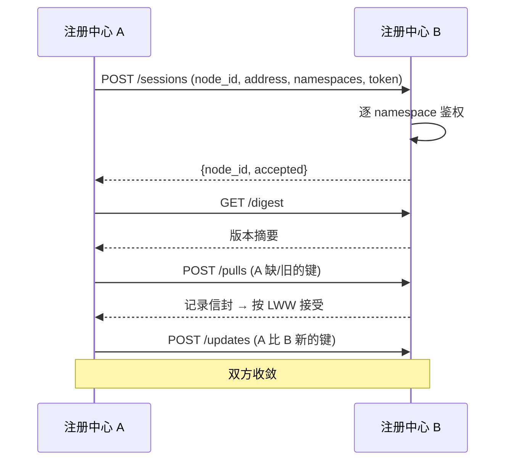
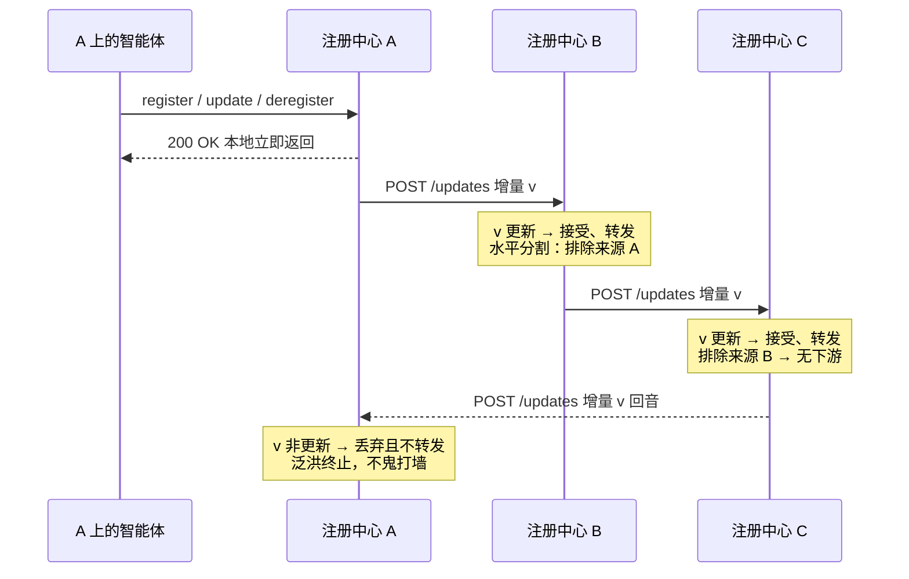
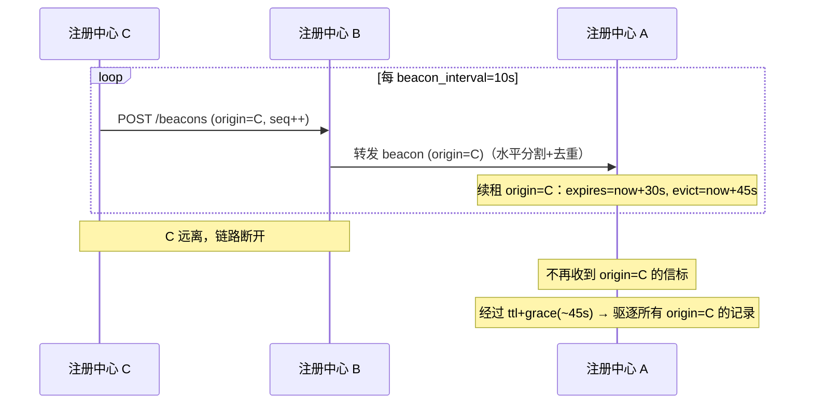
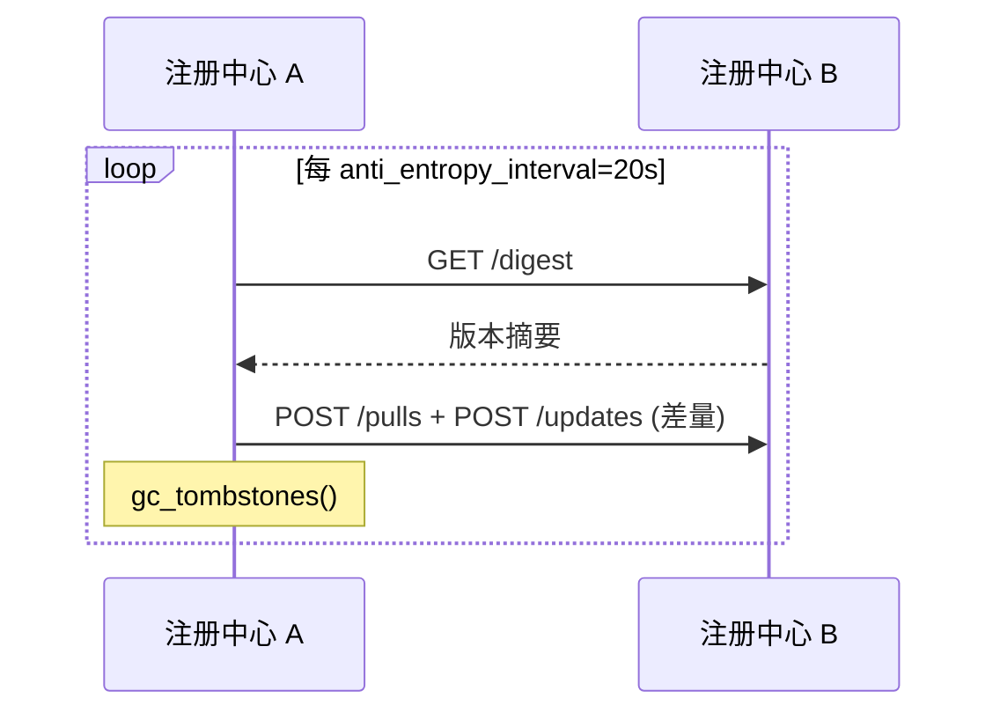
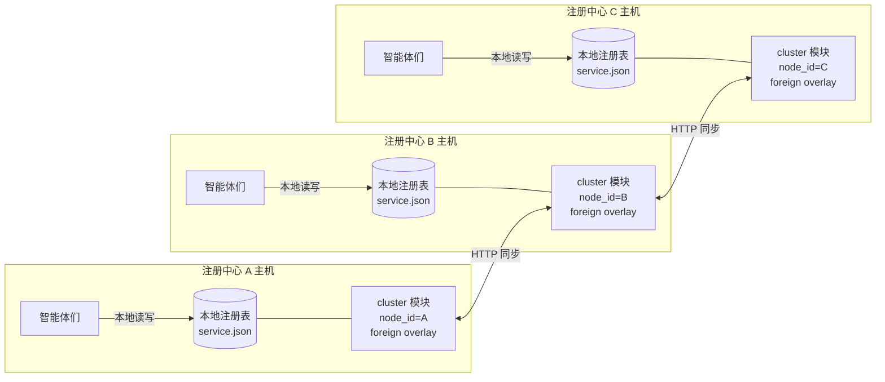

# Cluster 分布式同步模块设计

让多个**仅间歇连通**的 A2X 注册中心实例在彼此可达时互相复制各自的注册表：查询任意一个实例都能拿到所有可达实例的服务；实例之间断开后，各自靠存活信标失活删除对方的数据。

模块是 **opt-in**：注册中心默认单机运行，直到执行 `a2x-registry cluster init` 生成 `cluster_state.json` 才启用。未启用时所有 `/api/cluster/*` 返回 404，读路径与单机完全一致。

---

## 1. 流程逻辑

### 1.1 整体介绍

- **一致性**：AP / 最终一致。gossip 复制 + 最后写入者胜（LWW）版本判新，无共识 / 多数派。
- **写入**：origin-only。每条记录只在它的来源实例可写，其他实例持有**只读、仅内存**的副本。全局身份键 = `(dataset, origin_id, service_id)`，所以两个实例注册同名服务（同 `service_id`）也不会冲突，且不存在写-写冲突。
- **版本**：`(updated_at_ms, node_id)`，逐记录单调递增（本机时钟回拨也不会让它变小），按字典序比较。
- **防回音**：水平分割（不回发给来源）+ 严格版本去重（版本不严格新于本地则丢弃且不转发），泛洪自然终止。
- **删除**：墓碑携带版本，按 LWW 压过更旧的存活值；保留 `beacon_ttl + beacon_grace` 后 GC。
- **失活驱逐**：**以注册中心节点为单位**。每个实例广播自己的存活信标（BEACON），接收方为**每个来源节点**维护一条租约；信标停了，该节点的全部记录一次性被驱逐（详见 §1.2 失活时序）。

三层职责：

| 层 | 职责 | 关键类型 |
|----|------|----------|
| L1 会话 | OPEN 握手 + 逐 namespace 鉴权、peer 表、keepalive/HOLD | `Peer`、`auth_handshake` |
| L2 存活 | 按来源节点的租约，由信标续期；静默则驱逐 | `LeaseTable[node_id]`、`BeaconSweeper`、`KeepaliveMonitor` |
| L3 复制 | 本地 CRUD 后推送、入站接受 + 转发、周期反熵 | `SyncEnvelope`、`AntiEntropySweeper` |

租约状态机复用共享的 `a2x_registry.common.lease.LeaseTable`（心跳模块也用它）。

**数据模型（同步信封 `cluster/envelope.py`）**

```
dataset: str
service_id: str
origin_id: str                 # 所属节点；全局键 = (dataset, origin_id, service_id)
version: (updated_at_ms, node_id)
tombstone: bool
payload: {"entry": <RegistryEntry>, "wrapped": <列表输出行>} | None
```

**持久化状态（`cluster_state.json`，`cluster/state.py`）** —— 唯一落盘的集群状态；foreign 副本不落盘（重连后重新同步）。

```
node_id: str                   # 稳定 UUID 身份
version_clock: int             # 最后发出的版本时间戳(ms)
local_versions: {dataset\0sid: [ms, node_id]}
tombstones:     {dataset\0sid: {version, deleted_at_ms}}
```

位置：`A2X_REGISTRY_CLUSTER_STATE`，否则 `<A2X_REGISTRY_HOME>/cluster_state.json`。

**配置（`cluster/config.py` 默认值）**

| 字段 | 默认 | 含义 |
|------|------|------|
| `beacon_ttl` | 30s | 来源租约有效期 |
| `beacon_grace` | 15s | 过期后的宽限期；墓碑保留 = ttl + grace |
| `beacon_interval` | 10s | 信标广播 / 巡检周期 |
| `keepalive_interval` | 10s | 直链保活周期 |
| `hold_timeout` | 30s | 直链静默多久后断会话 |
| `anti_entropy_interval` | 20s | 反熵对账 + GC 周期 |
| `http_timeout` | 5s | 单次对端调用超时 |

`A2X_REGISTRY_CLUSTER_ADVERTISE` 设置对端访问本实例所用的 base URL。

### 1.2 时序图

**建链 + 初始全量对账**



**本地 CRUD 增量推送 + 链式转发（A–B–C）**



**存活信标与失活驱逐（信号断开后删除非局域网内数据）**



> 失活以**注册中心节点**为单位：一条来源租约管该节点的全部服务，不逐服务保活。直连邻居还有更快的 keepalive/HOLD（`hold_timeout=30s`）兜底断会话。从物理断开算起，默认约 **45 秒**（≈ ttl+grace，±信标间隔/巡检粒度）后该来源的服务从其它实例删除；可在 `ClusterConfig` 调小。

**周期反熵兜底**



### 1.3 部署图



- 每台主机 = 一组智能体 + 一个注册中心 server（FastAPI）+ 一个 cluster 模块（持有 foreign overlay 与来源租约）。
- 智能体只与**本地**注册中心交互（注册 / 查询）；查询时本地把"本地 entry + foreign 副本"合并返回。
- 实例间只通过 HTTP `/api/cluster/*` 通信。拓扑可以是星形、链形或环形；节点移动导致拓扑变化时，新链路自动建链对账、旧来源按租约失活。

---

## 2. 对外接口

### 2.1 REST（`/api/cluster/*`）

| 方法 + 路径 | 作用 |
|-------------|------|
| `POST /peers` | 触发：连接 `{address}` 并对账（CLI `add-peer` 在本机调它） |
| `GET /peers` | 列出当前会话 |
| `DELETE /peers/{node_id}` | 断开会话 + 删除该来源的副本 |
| `POST /sessions` | 接收 OPEN 握手（逐 namespace 鉴权） |
| `GET /digest?from_node=&namespaces=` | 返回 `[dataset, origin_id, service_id, version]` 行 |
| `POST /pulls` | 按键返回完整信封 |
| `POST /updates` | 接受入站信封（LWW 去重）+ 水平分割转发 |
| `POST /beacons` | 续期来源租约 + 转发 |
| `POST /keepalives` | 续期直链 HOLD 计时器 |
| `GET /state` | 节点 id + 同步快照 |

未初始化时每个路由返回 404。

### 2.2 CLI

```
a2x-registry cluster init                 # 生成 node id（opt-in 开关）
a2x-registry cluster add-peer <addr> [--namespaces a,b] [--token T] [--server URL]
a2x-registry cluster rm-peer  <node_id> [--server URL]
a2x-registry cluster status   [--server URL]
```

`add-peer` / `rm-peer` / `status` 是对本机 server `/api/cluster/*` 的**薄 HTTP 客户端**（跨平台，无 OS 专有 IPC；`trust_env=False` 避免系统代理拦截 localhost）。

### 2.3 握手鉴权 + 会话令牌（复用 auth 模块）

OPEN 时接收方逐"候选 namespace"（=对方提供的数据集 ∪ 自己的数据集）授权，语义与 auth 模块一致（`store is None` = 未启用鉴权 = 全放行）：

- 接收方**没有**该 namespace → 需 `admin` token（建一个临时副本承载）；未启用鉴权则直接放行。
- 接收方**有**该 namespace → 不要求鉴权则放行；否则需 scope 到它的 `provider`/`admin` token。

**会话令牌（仅在接收方启用鉴权时生效）**：握手成功后，启用鉴权的接收方签发一个随机 session secret，随 OPEN 响应返回，双方留存（`Peer.token`）。之后每次 RPC（digest/pull/updates/beacon/keepalive）经 `X-Cluster-Session` 头携带它，接收方据此校验 `from_node` 声明：

- **无鉴权集群**：不签发、不校验令牌（开放集群，逐调用无门槛）。
- **启用鉴权**：令牌有效 → 享有该会话协商到的 namespace；令牌缺失/错误 → **降级为匿名**，只能访问公共（非 `auth_required`）namespace。

由此，伪造 `from_node` 无法触达某特权节点的命名空间、也无法向 `auth_required` 命名空间推送数据。

**安全假设**：节点身份与命名空间授权由握手 token + 会话令牌保证；本期未对 RPC 载荷做端到端加密（依赖部署层 TLS / 可信链路）。

### 2.4 与注册中心其余部分的集成

- `RegistryService.set_on_mutation(cb)` —— additive、默认 no-op 的钩子，在每次本地 CRUD 成功后触发；cluster 用它打版本并推送增量。
- 数据集 list/get 端点合并 `ClusterStore.foreign_rows` / `foreign_entry`：foreign 行走**相同**的过滤管线，带命名空间化 id（`origin_id:service_id`）、`origin_id` 与 `source="cluster"`。本地 entry、持久化、taxonomy hash 均不受影响，A2X 搜索仍只覆盖本地服务。

---

## 3. 使用流程

下面以**两台注册中心 A、B 互联**为例串成闭环：**启用集群 → 各自启动 → 建立连接 → 任一实例查询得到全网服务**。三台及以上同理（对每条要建立的链路各跑一次 `add-peer`）。单机调试可在同一台机器用不同端口模拟。

> 跨机 / 本机多实例都先设 `export NO_PROXY=127.0.0.1,localhost`（避免系统代理拦截 localhost，见 CLAUDE.md）。

### 3.1 [每个注册中心主机] 安装 + 启用集群

```bash
pip install git+https://github.com/Weizheng96/A2X-registry.git@v0.2.0

# 启用集群：生成本实例的 node_id（写入 <A2X_REGISTRY_HOME>/cluster_state.json）
a2x-registry cluster init
```

`cluster init` 是**离线**操作，只生成身份文件，不经 HTTP、与 server 进程无关：

```
Cluster initialized.
  node_id : reg-99f79b5f9d04
  state   : /home/you/.a2x_registry/cluster_state.json
Restart the registry server for the cluster module to load.
```

> 不执行 `cluster init` 的实例就是普通单机注册中心，`/api/cluster/*` 全 404，行为与今天一致。鉴权是另一项可选特性，需要时按 [服务端 auth 流程](https://github.com/Weizheng96/A2X-registry) 先 `a2x-registry auth init`。

### 3.2 [每个注册中心主机] 启动 server（声明对外地址）

```bash
# A 主机
export A2X_REGISTRY_CLUSTER_ADVERTISE=http://<A 的IP>:8000
a2x-registry --host 0.0.0.0 --port 8000

# B 主机
export A2X_REGISTRY_CLUSTER_ADVERTISE=http://<B 的IP>:8000
a2x-registry --host 0.0.0.0 --port 8000
```

`A2X_REGISTRY_CLUSTER_ADVERTISE` = 对端回连本实例所用的 base URL；建链后两端互相记下对方地址用于同步。server 启动时会加载 cluster 模块并拉起后台守护线程（反熵 / 信标 / keepalive）。本机多实例调试时给每个实例不同的 `A2X_REGISTRY_HOME`、`A2X_REGISTRY_CLUSTER_STATE`、端口与 advertise 即可。

### 3.3 [A 主机] 建立连接

在 A 上把 B 接进来（"先发现方"发起，一条命令即建链 + 首次对账）：

```bash
a2x-registry cluster add-peer http://<B 的IP>:8000 --server http://127.0.0.1:8000
```

```jsonc
{ "peer": { "node_id": "reg-...(B)", "address": "http://<B 的IP>:8000",
            "namespaces": ["translators", "default"] } }
```

> 只需单向 `add-peer` 一次：发起方会与对端做**双向**对账（拉取对方更新、推送自己更新），两端随即收敛。带鉴权的 namespace 用 `--token <provider/admin token>`；用 `--namespaces a,b` 限定要同步的命名空间（默认同步两端命名空间的并集）。

### 3.4 [任一主机] 查询合并视图

集群启用后，**普通的数据集查询接口就会自动合并对端的服务**，无需改动客户端。foreign 行带命名空间化 id 与 `origin_id`：

```bash
# 在 A 上查 translators，既看到 A 本地的，也看到从 B 同步来的
curl http://127.0.0.1:8000/api/datasets/translators/services
```

```jsonc
[
  { "id": "generic_8f3c…",          "name": "EN-ZH Translator", "source": "api_config" },
  { "id": "reg-…(B):generic_1a2b…", "name": "ZH-EN Translator",
    "origin_id": "reg-…(B)", "source": "cluster" }      // ← 从 B 同步来的副本
]
```

用客户端 SDK 也一样（`list_agents` 返回里多出 foreign 行，命名空间化 id 可直接传给 `get_agent`）：

```python
from a2x_registry_client import A2XRegistryClient
c = A2XRegistryClient()
for a in c.list_agents("translators"):          # 本地 + 全网可达副本
    print(a["id"], a.get("origin_id", "(local)"))
detail = c.get_agent("translators", "reg-…(B):generic_1a2b…")   # 按命名空间化 id 取副本详情
```

> foreign 记录是**只读副本**：只能在它的来源实例修改 / 注销（origin-only）。要改 B 的服务，到 B 上操作；改动会经增量同步回到 A。

### 3.5 查看状态 / 断开

```bash
a2x-registry cluster status                  # 本节点 id、当前会话、各命名空间副本数
a2x-registry cluster rm-peer  reg-...(B)     # 主动断开 B + 删除 B 的副本
```

被动断开（B 漂走 / 宕机）无需任何操作：A 在 ~45s（`beacon_ttl + beacon_grace`）内不再收到 B 的信标后，自动失活删除 B 的全部副本；B 恢复可达后再 `add-peer` 重新对账补齐。

---

## 4. 鲁棒性

- 无单点：实例对等，任一宕机不影响其余实例本地读写；恢复后经对账重新收敛。
- 分区容忍：分区是常态，双方各自可用，愈合后最终收敛。
- 守护线程（`AntiEntropySweeper` / `BeaconSweeper` / `KeepaliveMonitor`）每个 tick 都被 try/except 包裹，单次异常只记日志、不中断循环。
- 同步端点幂等；内存有界（foreign 记录随来源驱逐释放，墓碑按期 GC）；推送 best-effort，由反熵保证最终收敛。
