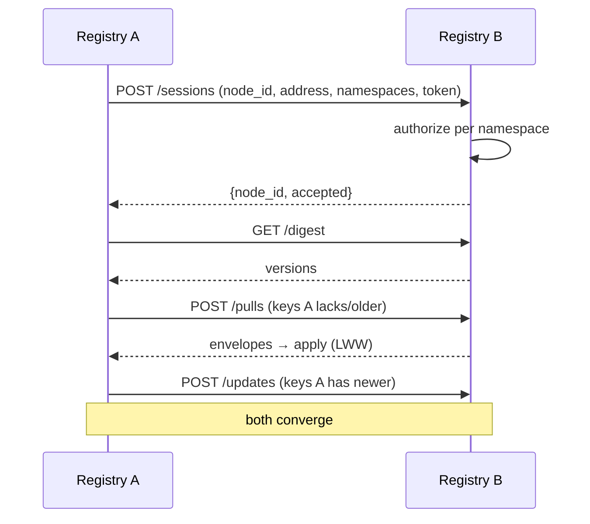
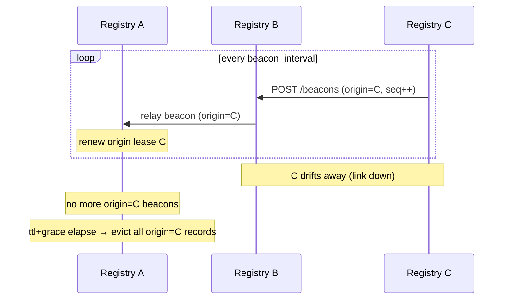
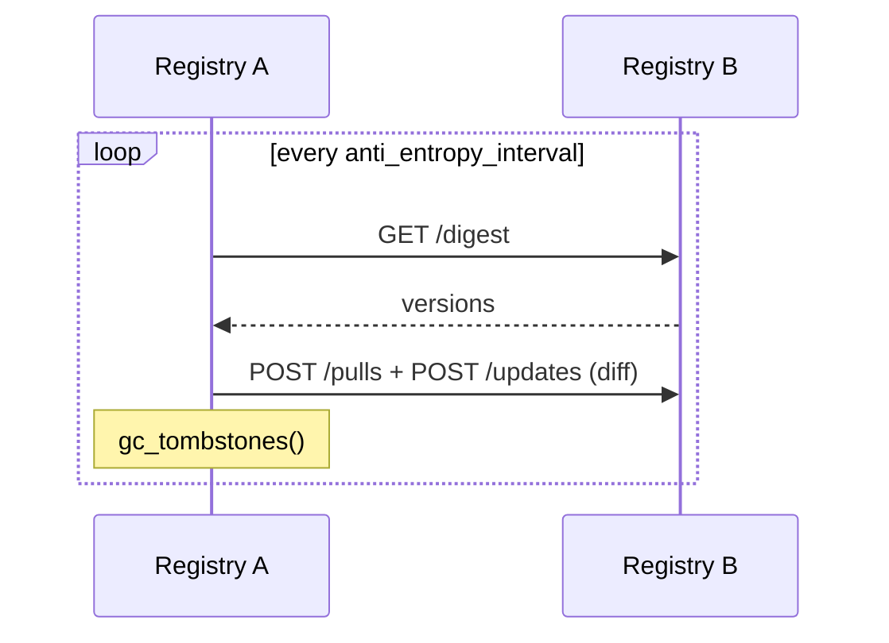
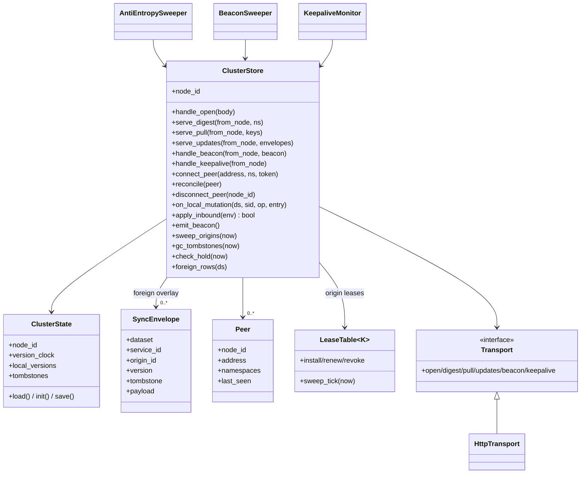

# Cluster (Distributed Sync) — Design

The cluster module lets multiple A2X Registry instances that are only
intermittently connected replicate their flat registry to one another. When
instances are reachable they sync; a query to any instance returns every
reachable instance's services. When instances drift apart, each drops the
other's records via liveness-lease expiry.

The module is **opt-in**: a registry runs standalone until
`a2x-registry cluster init` creates `cluster_state.json`. While not
initialized, every `/api/cluster/*` route returns 404 and the read path is
unchanged.

## Model

- **Consistency**: AP / eventually consistent. Gossip replication with
  last-write-wins (LWW) versioning. No consensus / quorum.
- **Writes**: origin-only. A record is only written on its origin instance;
  other instances hold **read-only, memory-only** replicas. The global
  identity of a record is `(dataset, origin_id, service_id)`, so two
  instances registering a same-named service (same `service_id`) never
  collide, and there are no write-write conflicts.
- **Version**: `(updated_at_ms, node_id)`, monotonic per record (a local
  clock step-back can't lower it). LWW compares lexicographically.
- **Loop freedom**: split-horizon (never send back to the sender) + strict
  version dedup (an envelope not newer than what we hold is dropped and not
  relayed), so floods terminate.
- **Deletion**: a tombstone carrying a version; it outranks an older live
  value by LWW. Retained for `beacon_ttl + beacon_grace`, then GC'd.

## Layers

| Layer | Responsibility | Key types |
|-------|----------------|-----------|
| L1 session | OPEN handshake + per-namespace auth, peer table, keepalive/HOLD | `Peer`, `auth_handshake` |
| L2 liveness | per-origin lease refreshed by beacons; eviction on silence | `LeaseTable[node_id]`, `BeaconSweeper`, `KeepaliveMonitor` |
| L3 replication | push on local CRUD, inbound apply + relay, anti-entropy | `SyncEnvelope`, `AntiEntropySweeper` |

The lease state machine is the shared `a2x_registry.common.lease.LeaseTable`
(also used by the heartbeat module).

## Data model

### SyncEnvelope (`cluster/envelope.py`)

```
dataset: str
service_id: str
origin_id: str                 # owning node; global key = (dataset, origin_id, service_id)
version: (updated_at_ms, node_id)
tombstone: bool
payload: {"entry": <RegistryEntry>, "wrapped": <list-output row>} | None
```

### Persisted state (`cluster_state.json`, `cluster/state.py`)

The only on-disk cluster state. Foreign replicas are NOT persisted (re-synced
on reconnect).

```
node_id: str                   # stable UUID identity
version_clock: int             # last emitted version timestamp (ms)
local_versions: {dataset\0sid: [ms, node_id]}
tombstones: {dataset\0sid: {version, deleted_at_ms}}
```

Location: `A2X_REGISTRY_CLUSTER_STATE`, else `<A2X_REGISTRY_HOME>/cluster_state.json`.

### Configuration (`cluster/config.py`, defaults)

| Field | Default | Meaning |
|-------|---------|---------|
| `beacon_ttl` | 30s | origin lease TTL |
| `beacon_grace` | 15s | grace before eviction; tombstone retention = ttl + grace |
| `beacon_interval` | 10s | beacon broadcast period |
| `keepalive_interval` | 10s | keepalive period |
| `hold_timeout` | 30s | direct-link silence before session drop |
| `anti_entropy_interval` | 20s | reconcile + GC period |
| `http_timeout` | 5s | per peer-call timeout |

`A2X_REGISTRY_CLUSTER_ADVERTISE` sets the base URL peers use to reach this
instance.

## Interfaces

### REST (`/api/cluster/*`)

| Method + path | Purpose |
|---------------|---------|
| `POST /peers` | trigger: connect to `{address}` and reconcile |
| `GET /peers` | list current sessions |
| `DELETE /peers/{node_id}` | drop a session + that origin's replicas |
| `POST /sessions` | receive an OPEN handshake (per-namespace authorization) |
| `GET /digest?from_node=&namespaces=` | `[dataset, origin_id, service_id, version]` rows |
| `POST /pulls` | full envelopes for requested keys |
| `POST /updates` | apply inbound envelopes (LWW dedup) + split-horizon relay |
| `POST /beacons` | refresh an origin's lease + relay |
| `POST /keepalives` | refresh a direct-link HOLD timer |
| `GET /state` | node id + sync snapshot |

Every route 404s when the module isn't initialized.

### CLI

```
a2x-registry cluster init                 # generate node id (opt-in switch)
a2x-registry cluster add-peer <addr> [--namespaces a,b] [--token T] [--server URL]
a2x-registry cluster rm-peer <node_id> [--server URL]
a2x-registry cluster status [--server URL]
```

`add-peer`/`rm-peer`/`status` are thin HTTP clients over the local server's
`/api/cluster/*` endpoints (cross-platform; no OS-specific IPC).

### Handshake authorization

On OPEN, the receiver authorizes each candidate namespace (the union of the
caller's offered datasets and its own), reusing the auth module
(`store is None` = no auth = allow):

- namespace the receiver lacks → needs an `admin` token (hosts an ephemeral
  copy); allowed outright with no auth configured.
- namespace the receiver has → allowed when not `auth_required`; otherwise
  needs a `provider`/`admin` token scoped to it.

### Integration with the rest of the registry

- `RegistryService.set_on_mutation(cb)` — additive, default-no-op hook fired
  after every successful local CRUD; the cluster store uses it to stamp a
  version and push the delta.
- The dataset list/get endpoints merge `ClusterStore.foreign_rows` /
  `foreign_entry`. Foreign rows go through the same filter pipeline and
  carry a namespaced id + `origin_id` + `source="cluster"`. Local entries,
  persistence, and the taxonomy hash are untouched, so A2X search runs over
  local services only.

## Sequence diagrams

### Connect + initial reconcile



### Incremental push + chain relay (A–B–C)

```mermaid
sequenceDiagram
    participant Ag as agent on A
    participant A as Registry A
    participant B as Registry B
    participant C as Registry C
    Ag->>A: register/update/deregister
    A-->>Ag: 200 OK
    A->>B: POST /updates (delta v)
    Note over B: v newer → apply, relay (split-horizon, excl. A)
    B->>C: POST /updates (delta v)
    Note over C: v newer → apply, relay (excl. B → none)
    Note over A,B,C: an echo of v is dropped (not newer) → flood ends
```

### Beacon liveness + eviction



### Anti-entropy



## Class diagram



## Robustness

- No single point of failure: instances are peers; one going down doesn't
  affect others' local read/write, and recovery re-syncs via reconcile.
- Partition-tolerant: partitions are normal; each side stays available and
  converges on heal.
- Daemons (`AntiEntropySweeper`, `BeaconSweeper`, `KeepaliveMonitor`) wrap
  each tick so one error never kills the loop.
- Idempotent sync endpoints; bounded memory (foreign records released on
  origin eviction; tombstones GC'd); push is best-effort with anti-entropy
  as the convergence guarantee.

## Manual two-instance check

```bash
export NO_PROXY=127.0.0.1,localhost
# instance 1
A2X_REGISTRY_HOME=/tmp/regA A2X_REGISTRY_CLUSTER_ADVERTISE=http://127.0.0.1:8001 \
  a2x-registry cluster init && a2x-registry --port 8001 &
# instance 2
A2X_REGISTRY_HOME=/tmp/regB A2X_REGISTRY_CLUSTER_ADVERTISE=http://127.0.0.1:8002 \
  a2x-registry cluster init && a2x-registry --port 8002 &
# connect 1 → 2, then list from either side
a2x-registry cluster add-peer http://127.0.0.1:8002 --server http://127.0.0.1:8001
```
