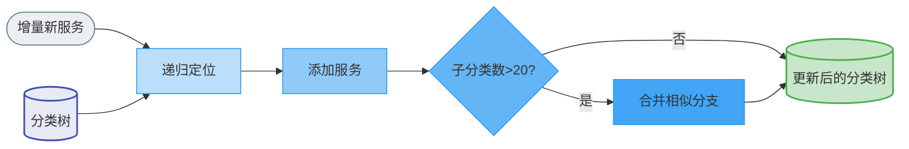
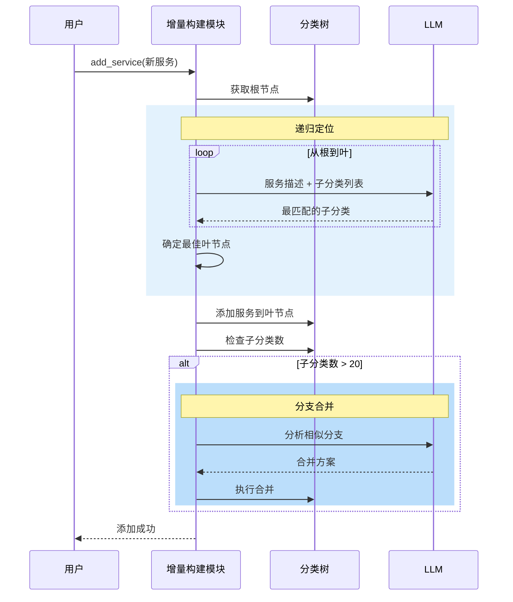
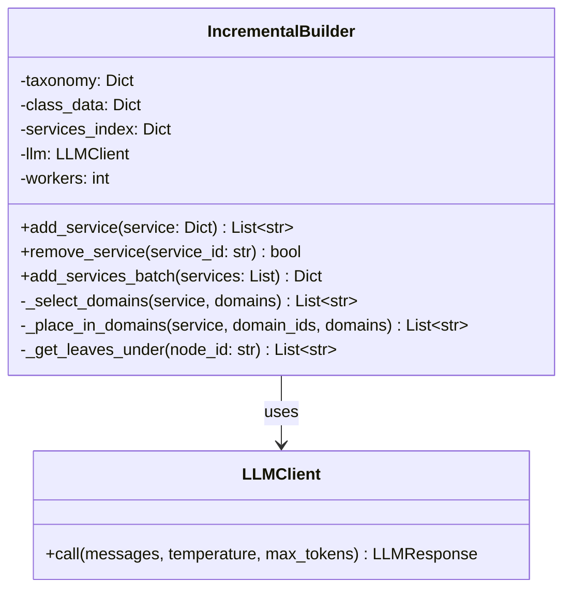

# A2X 增量构建模块设计文档（待实现）

**版本**: v0.1.0

本文档描述增量构建模块（`src/a2x/incremental/`）的设计。系统整体视图见 [a2x_design.md](a2x_design.md)。

---

## 1. 流程逻辑说明

增量构建模块负责将增量新服务插入已有分类树，无需重新构建整棵树：

1. **递归定位**：LLM 从根节点开始，逐层选择最匹配的子分类，直到叶节点
2. **添加服务**：将新服务添加到最佳叶节点的服务列表中
3. **分支合并**：若目标节点的子分类数超过阈值（如 20），触发相似分支合并

## 2. 对外调用接口

```python
class IncrementalBuilder:
    def __init__(self, taxonomy: dict, class_data: dict, services_index: dict, llm_client: LLMClient, workers: int = 20): ...

    def add_service(self, service: Dict) -> List[str]:
        """
        将新服务增量插入分类树中。

        Args:
            service: 服务字典，需包含 id, name, description 字段

        Returns:
            分配到的分类 ID 列表

        Side Effects:
            修改内存中的分类树结构
        """

    def remove_service(self, service_id: str) -> bool:
        """从分类树中移除服务。"""

    def add_services_batch(self, services: List[dict]) -> Dict[str, List[str]]:
        """批量添加服务（并行）。"""
```

## 3. 逻辑视图



## 4. 顺序图



## 5. 类图


