# A2X Registry Client SDK 设计方案

本 SDK 为开发者提供简化接口，调用后将函数参数翻译为对 A2X Registry FastAPI 后端（`docs/backend_api.md`）的 HTTP 请求。

**首要使用场景**：**Agent Team 注册与发现**。开发者将团队中的每个 Agent 以 [A2A Agent Card v0.0](../../src/register/validation.py) 格式注册到一个数据集中，并通过数据集管理团队成员、更新组队状态、查询成员。

---

## 0. 代码位置与独立性

- **实现路径**：[src/client/](../../src/client/)
- **独立发布**：`src/client/` 必须是一个**自包含**的 Python 包，**不依赖** `src/backend/` / `src/register/` / `src/common/` / `src/a2x/` 等项目内部模块。
- **对外依赖**：仅依赖 `httpx`（及 Python 标准库）。Python ≥ 3.10。
- **同步 + 异步双入口**：
  - `A2XClient` — 同步客户端（`httpx.Client` 驱动）
  - `AsyncA2XClient` — 异步客户端（`httpx.AsyncClient` 驱动）
  - **两者签名完全对称**，方法名、参数、返回类型、异常层级一致；仅 async 版的每个方法带 `async def`，返回 `Awaitable[T]`
- **两种使用方式**：
  1. **包内使用**：`from src.client import A2XClient, AsyncA2XClient`
  2. **独立分发**：打包为 `a2x-registry-client` 后 `from a2x_client import A2XClient, AsyncA2XClient`
- **原则**：此目录下的任何文件都不得 `import src.xxx`。需要与后端共享的数据结构（如 Agent Card schema），在 `src/client/models.py` 中**复刻**一份精简版，不 re-export 后端模型。

---

## 1. 开发者使用流程

典型使用路径 — 每个环节对应一个客户端 method：

```
  ┌──────────────────┐
  │ ① 初始化客户端   │  client = A2XClient(base_url=...)
  └────────┬─────────┘
           ▼
  ┌──────────────────┐
  │ ② 注册数据集     │  client.create_dataset(name, formats={"a2a": "v0.0"})
  └────────┬─────────┘
           ▼
  ┌──────────────────┐
  │ ③ 注册 Agent     │  client.register_agent(dataset, agent_card)
  │ （直接传 Card）   │
  └────────┬─────────┘
           ▼
  ┌──────────────────┐
  │ ④ 初始化组队状态 │  client.set_team_count(dataset, service_id, 0)  【可选步骤】
  └────────┬─────────┘
           ▼
  ┌──────────────────┐
  │ ⑤ 更新 Agent     │  client.update_agent(dataset, service_id, {...})
  │ （部分字段）      │
  └────────┬─────────┘
           ▼
  ┌──────────────────┐
  │ ⑥ 列出团队成员   │  client.list_agents(dataset)
  └────────┬─────────┘
           ▼
  ┌──────────────────┐
  │ ⑦ 查询 Agent     │  client.get_agent(dataset, service_id)
  └────────┬─────────┘
           ▼
  ┌──────────────────┐
  │ ⑧ 注销 Agent     │  client.deregister_agent(dataset, service_id)
  └────────┬─────────┘
           ▼
  ┌──────────────────┐
  │ ⑨ 注销数据集     │  client.delete_dataset(name)
  └──────────────────┘
```

### 1.1 所有权约束（只允许更新自己注册的服务）

SDK 维护 `_owned: dict[dataset, set[service_id]]`，记录**本客户端注册过的服务**：

| method | 会写入 `_owned`? | 会校验 `_owned`? |
|--------|:---------------:|:---------------:|
| `register_agent` | ✅ 注册成功后加入 | — |
| `update_agent` | — | ✅ 不属于则抛 `NotOwnedError` |
| `set_team_count` | — | ✅ 同上 |
| `deregister_agent` | 从 `_owned` 移除 | ✅ 同上 |
| `delete_dataset` | 移除整个 `_owned[dataset]` | — |
| `list_agents` / `get_agent` | — | — （只读不限） |

**持久化**：`_owned` 落盘保存在本地 JSON 文件（默认 `~/.a2x_client/owned.json`），**每次变更后立即写盘**（原子写：`.tmp` 文件 + `rename`）；客户端下次启动时自动加载。文件按 `base_url` 分段，以支持同一开发者连接多个后端：

```json
{
  "https://registry.example.com": {
    "research_team": ["agent_planner_xxx", "agent_researcher_yyy"]
  },
  "http://127.0.0.1:8000": {
    "test_team": ["agent_test_zzz"]
  }
}
```

初始化时只加载 `base_url` 对应的段。构造函数参数 `ownership_file` 可自定义路径；传 `False` 则禁用持久化，只在内存保留（进程退出即丢失）。

### 1.2 时序图

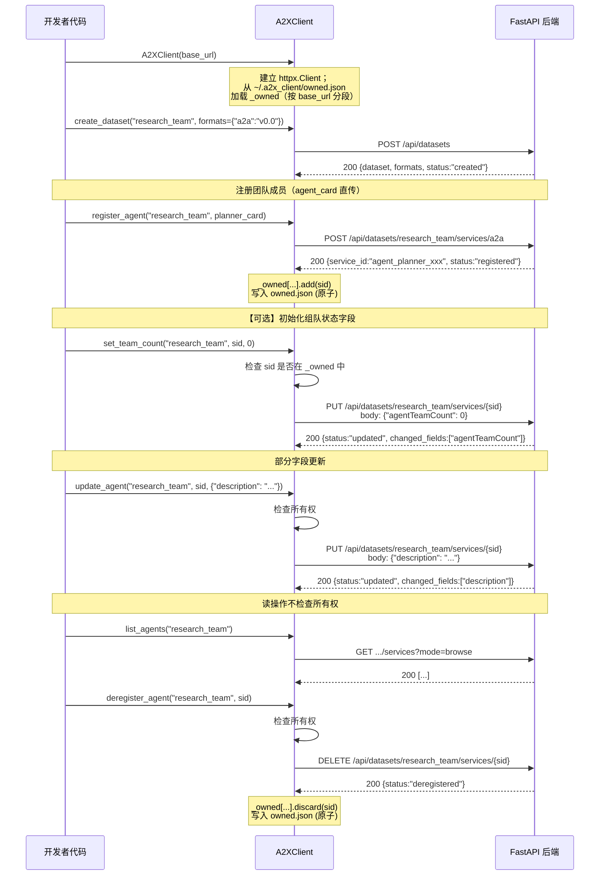

### 1.3 最小使用示例 — Agent Team 完整流程

```python
from a2x_client import A2XClient    # 或: from src.client import A2XClient

client = A2XClient(base_url="https://registry.example.com")

# ② 创建团队数据集（仅允许 A2A v0.0 格式注册）
client.create_dataset(
    "research_team",
    formats={"a2a": "v0.0"},
)

# ③ 注册团队成员（Agent Card v0.0：只需 name + description）
planner_card = {
    "protocolVersion": "0.0",
    "name": "Task Planner",
    "description": "拆解复杂任务为可执行子任务，协调其他 Agent 分工",
}

researcher_card = {
    "protocolVersion": "0.0",
    "name": "Web Researcher",
    "description": "基于关键词检索网页并摘要",
    "skills": [
        {"name": "search", "description": "搜索互联网"},
        {"name": "summarize", "description": "提炼关键信息"},
    ],
}

coder_card = {
    "protocolVersion": "0.0",
    "name": "Code Executor",
    "description": "在沙箱环境中执行 Python 代码",
}

planner   = client.register_agent("research_team", planner_card)
researcher = client.register_agent("research_team", researcher_card)
coder     = client.register_agent("research_team", coder_card)

# ④ 【可选步骤】初次注册后设置组队状态字段为 0
#   PUT 端点允许为 Agent Card 追加自定义字段 agentTeamCount
for agent in (planner, researcher, coder):
    client.set_team_count("research_team", agent.service_id, 0)

# ⑤ 后续更新 Agent 字段（部分字段，只传需要改的）
client.update_agent(
    dataset="research_team",
    service_id=researcher.service_id,
    fields={
        "description": "基于关键词检索网页、摘要、并支持多语种翻译",
        "skills": [
            {"name": "search", "description": "搜索互联网"},
            {"name": "summarize", "description": "提炼关键信息"},
            {"name": "translate", "description": "多语种翻译"},
        ],
    },
)

# 当实际组队形成时，更新 team count
client.set_team_count("research_team", planner.service_id, 3)
client.set_team_count("research_team", researcher.service_id, 3)
client.set_team_count("research_team", coder.service_id, 3)

# ⑥ 列出团队成员
for agent in client.list_agents("research_team"):
    print(agent.id, "—", agent.name, ":", agent.description)

# ⑦ 查询某成员完整信息（含自定义字段）
detail = client.get_agent("research_team", planner.service_id)
print(detail.name, "team count:", detail.metadata.get("agentTeamCount"))

# ⑧ 注销某个 Agent（必须是本 client 注册的）
client.deregister_agent("research_team", coder.service_id)

# ⑨ 清理数据集
client.delete_dataset("research_team")
```

**所有权错误示范：**

```python
# 另一台机器上的 client 实例（或同机用 ownership_file=False 的实例）
# 未注册过这些 agent 时：
other = A2XClient(
    base_url="https://registry.example.com",
    ownership_file=False,   # 禁用持久化 → _owned 从空开始
)

other.update_agent(                          # ❌
    "research_team", planner.service_id,
    {"description": "hacked"},
)
# → NotOwnedError: service 'agent_planner_xxx' was not registered by this client
```

> 同一台机器 / 同一用户再次启动 client（使用默认 `ownership_file`）会从 `~/.a2x_client/owned.json` 加载先前注册的服务，直接 `update_agent(...)` 即可，无需额外操作。

### 1.4 同步与异步对称

SDK 提供两个入口类，签名完全对称：

| 场景 | 同步 | 异步 |
|------|------|------|
| 入口类 | `A2XClient` | `AsyncA2XClient` |
| 底层 HTTP | `httpx.Client` | `httpx.AsyncClient` |
| 每个方法 | 普通函数 | `async def` → `Awaitable[T]` |
| 上下文管理 | `with A2XClient(...) as c:` | `async with AsyncA2XClient(...) as c:` |
| 返回类型 | 同上（同一批 dataclass） | 同上 |
| 异常 | 同一组 `A2XError` 子类 | 同一组 |
| 所有权持久化 | `OwnershipStore` (sync file I/O) | 同上；`_save()` 由 `AsyncA2XClient` 通过 `asyncio.to_thread()` 调度，避免阻塞事件循环 |

**异步示例**（与 §1.3 完全等价的 Agent Team 流程）：

```python
import asyncio
from a2x_client import AsyncA2XClient

async def main():
    async with AsyncA2XClient(base_url="https://registry.example.com") as client:
        await client.create_dataset("research_team", formats={"a2a": "v0.0"})

        planner = await client.register_agent("research_team", planner_card)
        researcher = await client.register_agent("research_team", researcher_card)
        coder = await client.register_agent("research_team", coder_card)

        # 并发初始化所有成员的 team count
        await asyncio.gather(*[
            client.set_team_count("research_team", a.service_id, 0)
            for a in (planner, researcher, coder)
        ])

        # 并发查询所有成员详情
        details = await asyncio.gather(*[
            client.get_agent("research_team", a.service_id)
            for a in (planner, researcher, coder)
        ])
        for d in details:
            print(d.name, "team count:", d.metadata.get("agentTeamCount"))

        await client.deregister_agent("research_team", coder.service_id)
        await client.delete_dataset("research_team")

asyncio.run(main())
```

> **何时选异步**：需要并发注册/查询多个 Agent（如 Agent Team 初始化）、或集成到已有的 asyncio / FastAPI / aiohttp 应用时。其余场景用同步版即可。

---

## 2. Method ↔ 后端 API 映射

本节对每个 method 说明**参数如何转化为 HTTP 报文**。后端 API 规范见 [docs/backend_api.md](../../docs/backend_api.md)。

> **同步 + 异步双形态**：下面每个方法签名同时是 `A2XClient`（同步调用）和 `AsyncA2XClient`（`await` 调用）的契约。以 `register_agent` 为例：
>
> ```python
> # 同步
> resp = client.register_agent(dataset, agent_card)
>
> # 异步（参数、返回类型完全相同）
> resp = await async_client.register_agent(dataset, agent_card)
> ```
>
> 为避免重复，后续各节只展示一份签名；对应的异步版本在前面加 `async def`、返回 `Awaitable[T]`。HTTP 报文和参数转换规则两者完全一致。

### 2.1 `A2XClient.__init__` — 初始化

**对外接口：**
```python
A2XClient(
    base_url: str = "http://127.0.0.1:8000",
    timeout: float = 30.0,
    api_key: str | None = None,
    ownership_file: Path | str | None | Literal[False] = None,
    # None → 默认 ~/.a2x_client/owned.json
    # False → 禁用持久化，仅内存
    # Path/str → 自定义路径
)
```

**内部行为**：不发 HTTP；创建 `httpx.Client` + 加载持久化的 `_owned`。

| 输入参数 | 转化结果 |
|---------|----------|
| `base_url` | `httpx.Client(base_url=...)` |
| `timeout` | `httpx.Client(timeout=...)` |
| `api_key` | 若非空，默认 header `Authorization: Bearer <api_key>` |
| `ownership_file` | 从 JSON 文件读取 `data[base_url]` 初始化 `_owned`；文件不存在则 `_owned = {}` |

**`_owned` 加载流程**：
1. 解析 `ownership_file`（`None` → `~/.a2x_client/owned.json`；`False` → 跳过，`_owned = {}`）
2. 若文件存在且可解析：读取 `data[self.base_url]` → `{dataset: [sid]}`；反序列化为 `{dataset: set(sid)}`
3. 文件缺失、损坏（JSON 解析失败）或 `base_url` 键不存在：`_owned = {}`，**不抛异常**（首次使用属正常）
4. `_save_owned()` 内部方法在每次 `_owned` 变化后被调用；写盘策略：
   - 读取已有文件（支持多 `base_url` 共存）
   - 替换 `data[self.base_url]` 段
   - 原子写：先写 `<file>.tmp`，再 `os.replace()` 覆盖原文件
   - 首次写入时自动创建父目录

---

### 2.2 `create_dataset` — 注册数据集

**对外接口：**
```python
client.create_dataset(
    name: str,
    embedding_model: str = "all-MiniLM-L6-v2",
    formats: dict[str, str] | None = {"a2a": "v0.0"},
) -> DatasetCreateResponse
# { dataset: str, embedding_model: str, formats: dict, status: "created" }
```

**默认 `formats`**：Agent Team 场景 SDK 默认把数据集锁定为**仅接受 A2A v0.0** 注册。若调用方希望同时接受 generic/skill，可显式覆盖，例如 `formats={"a2a": "v0.0", "generic": "v0.0"}`。传 `None` → SDK 省略该字段，后端使用其默认（三种类型全开）。

**对应后端**：`POST /api/datasets`

**HTTP 报文：**
```http
POST /api/datasets HTTP/1.1
Content-Type: application/json

{
  "name": "<name>",
  "embedding_model": "<embedding_model>",
  "formats": {"a2a": "v0.0"}
}
```

| SDK 参数 | 报文位置 | 说明 |
|---------|---------|------|
| `name` | body `.name` | — |
| `embedding_model` | body `.embedding_model` | 默认 `"all-MiniLM-L6-v2"` |
| `formats` | body `.formats` | `None` 时省略该字段；否则原样发送 |

---

### 2.3 `register_agent` — 注册 Agent

**对外接口：**
```python
client.register_agent(
    dataset: str,
    agent_card: dict,
    service_id: str | None = None,
    persistent: bool = True,
) -> RegisterResponse
# { service_id, dataset, status: "registered" | "updated" }
```

**Agent Card v0.0 最小字段**：
```python
{"protocolVersion": "0.0", "name": "<required>", "description": "<required>"}
```

**对应后端**：`POST /api/datasets/{dataset}/services/a2a`

**HTTP 报文：**
```http
POST /api/datasets/<dataset>/services/a2a HTTP/1.1
Content-Type: application/json

{
  "agent_card": { ...原样透传 agent_card dict... },
  "service_id": "<service_id>",
  "persistent": true
}
```

| SDK 参数 | 报文位置 | 转换规则 |
|---------|---------|---------|
| `dataset` | URL path | URL-encode |
| `agent_card` | body `.agent_card` | dict 整体透传，保留 camelCase（`protocolVersion`、`defaultInputModes` 等） |
| `service_id` | body `.service_id` | `None` 时省略；由后端生成 |
| `persistent` | body `.persistent` | 默认 `true` |

**副作用**：成功后将 `resp.service_id` 加入 `_owned[dataset]`，并立即持久化到 `ownership_file`。

> 不使用 URL 模式（`agent_card_url`）。如需该能力可扩展 `register_agent_from_url()`。

---

### 2.4 `update_agent` — 部分字段更新

> **语义**：后端 `PUT` 端点实现的是**顶层字段 upsert**（存在则替换、不存在则追加），不是全量覆盖。因此 `update_agent` 只需传**要改的字段**。

**对外接口：**
```python
client.update_agent(
    dataset: str,
    service_id: str,
    fields: dict,
) -> PatchResponse
# { service_id, dataset, status:"updated",
#   changed_fields: list[str], taxonomy_affected: bool }
```

**对应后端**：`PUT /api/datasets/{dataset}/services/{service_id}`

**HTTP 报文：**
```http
PUT /api/datasets/<dataset>/services/<service_id> HTTP/1.1
Content-Type: application/json

{ ...fields 原样透传... }
```

| SDK 参数 | 报文位置 | 转换规则 |
|---------|---------|---------|
| `dataset` | URL path | URL-encode |
| `service_id` | URL path | URL-encode |
| `fields` | body（整个对象） | dict 整体作为 request body；不包装 |

**可改字段**（a2a 类型）：Agent Card 任意顶层字段，包括 `extra=allow` 允许的自定义字段（如 `agentTeamCount`）。想改嵌套字段（如 `provider.url`）必须整段重传 `provider`。

**前置检查**：`service_id ∈ _owned[dataset]`，否则抛 `NotOwnedError`（本地 fail-fast，不发请求）。

**错误映射**：
- 404 → `NotFoundError`（`service_id` 不存在于后端；可能意味着本地 `_owned` 与后端不同步）
- 400 → `ValidationError`（`user_config` 来源 / 改名冲突）

---

### 2.5 `set_team_count` — 设置/更新组队状态字段（可选步骤）

> **用途**：为 Agent Card 追加或更新一个自定义顶层字段 `agentTeamCount: int`，记录该 Agent 当前所在团队人数。属于**可选步骤**：Agent Team 场景下推荐在初次 `register_agent` 成功后立即调用一次，把 `count` 设为 `0`；后续成员加入/退出时再更新。

**对外接口：**
```python
client.set_team_count(
    dataset: str,
    service_id: str,
    count: int,        # 非负整数
) -> PatchResponse
```

**对应后端**：`PUT /api/datasets/{dataset}/services/{service_id}`（与 2.4 同端点）

**HTTP 报文：**
```http
PUT /api/datasets/<dataset>/services/<service_id> HTTP/1.1
Content-Type: application/json

{"agentTeamCount": <count>}
```

| SDK 参数 | 报文位置 | 转换规则 |
|---------|---------|---------|
| `dataset` | URL path | URL-encode |
| `service_id` | URL path | URL-encode |
| `count` | body `.agentTeamCount` | 整数；SDK 负责字段命名（camelCase） |

**前置检查**：与 2.4 相同，`service_id ∈ _owned[dataset]`。

**实现备注**：本 method 是 `update_agent(dataset, sid, {"agentTeamCount": count})` 的**薄封装**，目的是为首要客户提供一个语义清晰的入口；底层完全复用 PUT 端点。字段名 `agentTeamCount` 由 SDK 固定，调用方不能通过此 method 改名。

**为什么能追加自定义字段**：后端 `AgentCard` Pydantic 模型声明 `model_config = ConfigDict(extra="allow")`（见 `src/register/models.py:64`），所以未知顶层字段会被完整保留并写入 `service.json`，不会被 Pydantic 过滤。

---

### 2.6 `list_agents` — 列出团队成员

**对外接口：**
```python
client.list_agents(dataset: str) -> list[AgentBrief]
# AgentBrief: { id, name, description }
```

**对应后端**：`GET /api/datasets/{dataset}/services?mode=browse`

**HTTP 报文：**
```http
GET /api/datasets/<dataset>/services?mode=browse HTTP/1.1
Accept: application/json
```

数据集为空或不存在返回 `[]`（非 404）。不做所有权校验——只读。

---

### 2.7 `get_agent` — 按 ID 精确查询

**对外接口：**
```python
client.get_agent(dataset: str, service_id: str) -> AgentDetail
# AgentDetail:
#   id: str; type: "a2a"; name: str; description: str
#   metadata: dict      # 完整 Agent Card（含 agentTeamCount 等自定义字段）
#   raw: dict
```

**对应后端**：`GET /api/datasets/{dataset}/services?mode=single&service_id=...`

**HTTP 报文：**
```http
GET /api/datasets/<dataset>/services?mode=single&service_id=<sid> HTTP/1.1
Accept: application/json
```

**响应处理**：
- `200 + application/json` → 解析，a2a 类型取 `metadata` 为完整 AgentCard
- `200 + application/zip` → skill 类型（不在本范围）；抛 `UnexpectedServiceTypeError`
- `404` → `NotFoundError`

不做所有权校验——只读。

---

### 2.8 `deregister_agent` — 注销 Agent

**对外接口：**
```python
client.deregister_agent(dataset: str, service_id: str) -> DeregisterResponse
# { service_id, status: "deregistered" | "not_found" }
```

**对应后端**：`DELETE /api/datasets/{dataset}/services/{service_id}`

**HTTP 报文：**
```http
DELETE /api/datasets/<dataset>/services/<service_id> HTTP/1.1
```

**前置检查**：`service_id ∈ _owned[dataset]`，否则抛 `NotOwnedError`。
**副作用**：成功后从 `_owned[dataset]` 移除，并立即持久化到 `ownership_file`。

**特殊响应**：
- 服务不存在：后端 200 + `{"status": "not_found"}`（不是 404），SDK 原样返回
- 来源为 `user_config`：后端 400 → SDK 抛 `UserConfigDeregisterForbiddenError`（Agent Team 场景下通过 API 注册不会触发）

---

### 2.9 `delete_dataset` — 注销数据集

**对外接口：**
```python
client.delete_dataset(name: str) -> DatasetDeleteResponse
```

**对应后端**：`DELETE /api/datasets/{name}`

**HTTP 报文：**
```http
DELETE /api/datasets/<name> HTTP/1.1
```

**副作用**：成功后清空 `_owned[name]`（该数据集下所有服务的所有权记录），并立即持久化到 `ownership_file`。

数据集不存在 → 后端 400 → `ValidationError`。

> **设计决策**：`delete_dataset` 不做所有权检查（数据集层面当前无创建者追踪）。

---

### 2.10 参数转换通用规则

| 规则 | 说明 |
|------|------|
| **URL path** | `httpx` 自带 URL-encode |
| **`None` 字段过滤** | body dict 序列化前剔除值为 `None` 的键 |
| **Agent Card 透传** | `agent_card` / `fields` dict 整体放入 body；**不做字段重命名** |
| **所有权 fail-fast** | 所有权不匹配在 SDK 本地抛 `NotOwnedError`，不发 HTTP |
| **HTTP 错误** | 4xx/5xx 通过 `_wrap_http_error()` 映射为 `A2XError` 子类 |
| **JSON 反序列化** | dataclass `from_dict` 工厂，容忍多余字段；原始响应保留在 `raw` |

---

## 3. 客户端内部实现

本章分为 3 个小节：**3.1 类图** 展示模块间的静态结构；**3.2 模块接口功能介绍** 逐个说明每个内部模块对外暴露的 API；**3.3 调用时序图** 为每个对外接口画出模块间协作时序。

### 3.1 类图

```mermaid
classDiagram
    class A2XClient {
        +base_url: str
        +timeout: float
        +api_key: str
        -_transport: HTTPTransport
        -_owned: OwnershipStore
        +create_dataset(...) DatasetCreateResponse
        +delete_dataset(name) DatasetDeleteResponse
        +register_agent(...) RegisterResponse
        +update_agent(...) PatchResponse
        +set_team_count(...) PatchResponse
        +list_agents(dataset) list~AgentBrief~
        +get_agent(dataset, service_id) AgentDetail
        +deregister_agent(...) DeregisterResponse
        +close() None
        +__enter__() A2XClient
        +__exit__() None
        -_assert_owned(ds, sid) None
    }

    class AsyncA2XClient {
        +base_url: str
        +timeout: float
        +api_key: str
        -_transport: AsyncHTTPTransport
        -_owned: OwnershipStore
        +create_dataset(...) Awaitable~DatasetCreateResponse~
        +delete_dataset(name) Awaitable~DatasetDeleteResponse~
        +register_agent(...) Awaitable~RegisterResponse~
        +update_agent(...) Awaitable~PatchResponse~
        +set_team_count(...) Awaitable~PatchResponse~
        +list_agents(dataset) Awaitable~list~AgentBrief~~
        +get_agent(...) Awaitable~AgentDetail~
        +deregister_agent(...) Awaitable~DeregisterResponse~
        +aclose() Awaitable~None~
        +__aenter__() Awaitable~AsyncA2XClient~
        +__aexit__() Awaitable~None~
        -_assert_owned(ds, sid) None
    }

    class HTTPTransport {
        -_client: httpx.Client
        +request(method, path, json, params) httpx.Response
        +close() None
        -_wrap_http_error(resp) A2XError
    }

    class AsyncHTTPTransport {
        -_client: httpx.AsyncClient
        +request(method, path, json, params) Awaitable~httpx.Response~
        +aclose() Awaitable~None~
        -_wrap_http_error(resp) A2XError
    }

    class OwnershipStore {
        -_file_path: Path
        -_base_url: str
        -_data: dict~str, set~str~~
        +contains(dataset, service_id) bool
        +add(dataset, service_id) None
        +remove(dataset, service_id) None
        +remove_dataset(dataset) None
        -_load() None
        -_save() None
    }

    class DatasetCreateResponse {
        +dataset: str
        +embedding_model: str
        +formats: dict
        +status: str
    }
    class DatasetDeleteResponse {
        +dataset: str
        +status: str
    }
    class RegisterResponse {
        +service_id: str
        +dataset: str
        +status: str
    }
    class PatchResponse {
        +service_id: str
        +dataset: str
        +status: str
        +changed_fields: list~str~
        +taxonomy_affected: bool
    }
    class DeregisterResponse {
        +service_id: str
        +status: str
    }
    class AgentBrief {
        +id: str
        +name: str
        +description: str
    }
    class AgentDetail {
        +id: str
        +type: str
        +name: str
        +description: str
        +metadata: dict
        +raw: dict
    }

    class A2XError {
        <<exception>>
        +status_code: int
        +payload: dict
    }
    class A2XHTTPError
    class A2XConnectionError
    class NotFoundError
    class ValidationError
    class NotOwnedError
    class UserConfigDeregisterForbiddenError
    class UnexpectedServiceTypeError

    A2XClient *-- HTTPTransport : owns
    A2XClient *-- OwnershipStore : owns
    AsyncA2XClient *-- AsyncHTTPTransport : owns
    AsyncA2XClient *-- OwnershipStore : owns
    A2XClient ..> DatasetCreateResponse : returns
    A2XClient ..> RegisterResponse : returns
    A2XClient ..> PatchResponse : returns
    A2XClient ..> DeregisterResponse : returns
    A2XClient ..> AgentBrief : returns
    A2XClient ..> AgentDetail : returns
    AsyncA2XClient ..> DatasetCreateResponse : returns
    AsyncA2XClient ..> RegisterResponse : returns
    AsyncA2XClient ..> PatchResponse : returns
    AsyncA2XClient ..> DeregisterResponse : returns
    AsyncA2XClient ..> AgentBrief : returns
    AsyncA2XClient ..> AgentDetail : returns
    A2XClient ..> NotOwnedError : raises
    AsyncA2XClient ..> NotOwnedError : raises
    HTTPTransport ..> A2XError : raises
    AsyncHTTPTransport ..> A2XError : raises
    A2XError <|-- A2XHTTPError
    A2XError <|-- A2XConnectionError
    A2XError <|-- NotOwnedError
    A2XHTTPError <|-- NotFoundError
    A2XHTTPError <|-- ValidationError
    ValidationError <|-- UserConfigDeregisterForbiddenError
    A2XHTTPError <|-- UnexpectedServiceTypeError
```

> `A2XClient` 和 `AsyncA2XClient` 结构对称、不共享基类（避免 abstract method 之类的复杂继承）。两者分别组合 `HTTPTransport` / `AsyncHTTPTransport`，但共享同一个 `OwnershipStore`（文件 I/O 本身同步）。

**目录结构**（对应类图中各模块的物理位置）：

```
src/client/
├── __init__.py          # 导出 A2XClient, AsyncA2XClient、异常、dataclass
├── client.py            # A2XClient（同步）
├── async_client.py      # AsyncA2XClient（异步）
├── transport.py         # HTTPTransport + AsyncHTTPTransport
├── ownership.py         # OwnershipStore（同步文件 I/O，两端共用）
├── models.py            # 响应 dataclass
├── errors.py            # A2XError 及子类
├── py.typed             # PEP 561 类型标记
├── pyproject.toml       # 独立打包时用
└── README.md
```

**独立性自检**：`grep -r "from src\." src/client/ | grep -v "from src\.client"` 应无命中。CI 加此断言，防止误引入项目内部依赖。

---

### 3.2 内部模块接口功能介绍

SDK 划分为 **5 个内部模块**，每个模块单文件。下面逐个说明其职责和对外暴露的 API（对外 = 对 SDK 内部其他模块；最终用户只直接使用 `A2XClient`、响应 dataclass、异常类）。

#### 3.2.1 `client.py` / `async_client.py` — `A2XClient` / `AsyncA2XClient`

**定位**：SDK 对最终用户暴露的两个对称入口类。组合 `HTTPTransport` / `AsyncHTTPTransport` + `OwnershipStore`，把业务逻辑翻译为对其他模块的调用。

**对用户暴露的接口**：§2 已完整列出 8 个 method + `__init__` / 生命周期管理。两个类**接口签名完全对称**：

| 关注点 | `A2XClient` (sync) | `AsyncA2XClient` (async) |
|--------|---------------------|---------------------------|
| 方法定义 | `def method(...)` | `async def method(...)` |
| 返回值 | `T` | `Awaitable[T]` |
| 生命周期 | `close()` / `__enter__` / `__exit__` | `aclose()` / `__aenter__` / `__aexit__` |
| Transport | `HTTPTransport` | `AsyncHTTPTransport` |
| OwnershipStore I/O | 直接调 `_save()` | `await asyncio.to_thread(store._save)`（避免阻塞事件循环） |

**对内部其他模块的依赖**：
```python
# A2XClient
self._transport: HTTPTransport
self._owned: OwnershipStore

# AsyncA2XClient
self._transport: AsyncHTTPTransport
self._owned: OwnershipStore   # 同类型，文件 I/O 本身同步
```

**职责边界**（两个类一致）：
- ✅ 参数组装（构造 body dict、剔除 None、重命名 `input_schema → inputSchema`、`count → agentTeamCount`）
- ✅ 所有权前置检查（调 `OwnershipStore.contains`）
- ✅ 响应反序列化（调 `<Model>.from_dict(resp.json())`）
- ✅ 特殊分支处理（`get_agent` 的 Content-Type 判断）
- ❌ 不自己发 HTTP（委托 transport）
- ❌ 不自己读写文件（委托 `OwnershipStore`）
- ❌ 不自己做 HTTP 错误映射（transport 在 `request()` 里做了）

**实现策略**：两个类**不共享基类**（避免 abstract method 层层继承）。最合理的方式是把可复用的纯计算函数（如 body 构造、字段重命名）抽到模块级函数，两个类分别调用。业务流程代码会有一定重复（8 个方法 × 2），但换来清晰的同步/异步契约和简单的调用栈。

---

#### 3.2.2 `transport.py` — `HTTPTransport` / `AsyncHTTPTransport`

**定位**：httpx 的极简封装，SDK **唯一**的网络出口。同文件提供同步和异步两个类，接口镜像。

**对外暴露 — 同步版（供 `A2XClient` 调用）**：

```python
class HTTPTransport:
    def __init__(
        self,
        base_url: str,
        timeout: float = 30.0,
        headers: dict[str, str] | None = None,
    ) -> None:
        """构造时不发 HTTP，只建立 httpx.Client 连接池。"""

    def request(
        self,
        method: Literal["GET", "POST", "PUT", "DELETE"],
        path: str,                      # 相对路径
        *,
        json: dict | None = None,
        params: dict | None = None,
    ) -> httpx.Response:
        """2xx 原样返回 Response；4xx/5xx 抛 A2XError 子类。"""

    def close(self) -> None: ...
    def __enter__(self) -> "HTTPTransport": ...
    def __exit__(self, *exc) -> None: ...
```

**对外暴露 — 异步版（供 `AsyncA2XClient` 调用）**：

```python
class AsyncHTTPTransport:
    def __init__(
        self,
        base_url: str,
        timeout: float = 30.0,
        headers: dict[str, str] | None = None,
    ) -> None:
        """构造 httpx.AsyncClient。"""

    async def request(
        self,
        method: Literal["GET", "POST", "PUT", "DELETE"],
        path: str,
        *,
        json: dict | None = None,
        params: dict | None = None,
    ) -> httpx.Response:
        """签名与 HTTPTransport.request 一致，但是协程。"""

    async def aclose(self) -> None: ...
    async def __aenter__(self) -> "AsyncHTTPTransport": ...
    async def __aexit__(self, *exc) -> None: ...
```

**内部私有**（两者共享）：
- `_client: httpx.Client | httpx.AsyncClient`
- `_wrap_http_error(resp) -> A2XError` — 映射规则（同步/异步一致）：
  - `404` → `NotFoundError`
  - `400 / 422` → `ValidationError`；若 `detail` 含 `"user_config"` → `UserConfigDeregisterForbiddenError`
  - `5xx` → `ServerError`
  - `httpx.ConnectError` / `httpx.TimeoutException` → `A2XConnectionError`

可将 `_wrap_http_error` 抽为模块级函数（不依赖 self），两个类共用，避免重复。

**关键设计决策**：
1. **只有一个公开方法 `request()`**。不为每个 HTTP verb 单独造 `get/post/put/delete`
2. **返回 `httpx.Response`（不是 dict）**。`get_agent` 需要检查 `Content-Type`，若 transport 先吞 JSON 解析此分支即被破坏
3. **不做 retry / 拦截器 / middleware**。当前不需要；未来加在 `request()` 内部，不改公开接口
4. **同步/异步不共享基类**。两个类独立实现；错误映射逻辑提到模块级函数复用

---

#### 3.2.3 `ownership.py` — `OwnershipStore`

**定位**：`_owned` 字典的持有者 + 本地 JSON 文件的读写者。

**对外暴露**（供 `A2XClient` 调用）：

```python
class OwnershipStore:
    def __init__(
        self,
        file_path: Path | None,   # None → 禁用持久化（内存模式）
        base_url: str,            # 用作 JSON 文件中的顶层分段 key
    ) -> None:
        """构造时自动调 _load()。"""

    def contains(self, dataset: str, service_id: str) -> bool:
        """所有权检查；A2XClient 在 update/set/deregister 前调用。"""

    def add(self, dataset: str, service_id: str) -> None:
        """加入 _owned[dataset]，随即 _save()。幂等。"""

    def remove(self, dataset: str, service_id: str) -> None:
        """从 _owned[dataset] 移除，随即 _save()。不存在时静默忽略。"""

    def remove_dataset(self, dataset: str) -> None:
        """清空 _owned[dataset]，随即 _save()。delete_dataset 调用。"""
```

**内部私有**：
- `_data: dict[str, set[str]]` — 内存中的 `{dataset: {service_id}}`
- `_load()` — 读 JSON 文件 → `data[self._base_url]` 段 → 反序列化为 `set`
- `_save()` — 读 → 改 → 原子写（`.tmp` + `os.replace`）

**关键设计决策**：
1. **按 `base_url` 分段**，支持同一个文件管理多个后端
2. **每次变更立即 `_save()`**：没有批量合并/延迟刷新，避免崩溃丢数据
3. **容忍 I/O 异常**：`_load` 遇到损坏 JSON 不抛，从空开始（首次启动正常）；`_save` 遇到磁盘满等错误抛 `OSError`（由上层决定是否忽略）
4. **文件不存在不等于错误**：首次使用时预期如此
5. **同步实现，两个客户端共用**：本地文件 I/O 通常 < 1ms，没有独立的 async 版本。`AsyncA2XClient` 调用 `add` / `remove` / `remove_dataset` 时通过 `await asyncio.to_thread(...)` 把同步调用调度到线程池，避免阻塞事件循环；`contains`（纯内存查询）直接同步调用即可

---

#### 3.2.4 `models.py` — 响应 dataclass

**定位**：后端 HTTP 响应 → 强类型 Python 对象。

**对外暴露**：

| dataclass | 来源端点 | 字段 |
|-----------|----------|------|
| `DatasetCreateResponse` | `POST /api/datasets` | `dataset, embedding_model, formats, status` |
| `DatasetDeleteResponse` | `DELETE /api/datasets/{ds}` | `dataset, status` |
| `RegisterResponse` | `POST .../services/a2a` | `service_id, dataset, status` |
| `PatchResponse` | `PUT .../services/{sid}` | `service_id, dataset, status, changed_fields, taxonomy_affected` |
| `DeregisterResponse` | `DELETE .../services/{sid}` | `service_id, status` |
| `AgentBrief` | `GET .../services?mode=browse` 的列表元素 | `id, name, description` |
| `AgentDetail` | `GET .../services?mode=single` | `id, type, name, description, metadata, raw` |

**共同接口**：每个类提供 `@classmethod from_dict(cls, d: dict) -> Self`，容忍响应中的多余字段（forward-compatible）；`AgentDetail.raw` 保留完整原始 dict 供访问未声明字段（如 `agentTeamCount`）。

**关键设计决策**：
1. **用 `@dataclass` 而不是 Pydantic**：减少依赖（仅 `httpx` + stdlib）
2. **`from_dict` 只接受已声明字段，其余丢弃到 `raw`**：避免未来后端加字段破坏反序列化

---

#### 3.2.5 `errors.py` — 异常体系

**定位**：统一的异常层级，便于用户 `except`。

**对外暴露**：

```python
class A2XError(Exception):
    """基类。携带 status_code: int | None 和 payload: dict | None。"""

class A2XConnectionError(A2XError): ...      # 网络/超时
class A2XHTTPError(A2XError): ...            # 4xx/5xx 通用
class NotFoundError(A2XHTTPError): ...       # 404
class ValidationError(A2XHTTPError): ...     # 400/422
class UserConfigDeregisterForbiddenError(ValidationError): ...
class UnexpectedServiceTypeError(A2XHTTPError): ...  # get_agent 遇 ZIP
class ServerError(A2XHTTPError): ...         # 5xx
class NotOwnedError(A2XError): ...           # 本地所有权检查失败
```

**关键设计决策**：
1. **`NotOwnedError` 不继承 `A2XHTTPError`**：它是本地业务错误，没有 `status_code`
2. **`UserConfigDeregisterForbiddenError` 继承 `ValidationError`**：用户如果只 `except ValidationError` 也能捕获
3. **异常对象只携带数据**，不做 logging / reporting（那是用户职责）

---

### 3.3 对外接口 → 内部调用时序图

以下 9 张时序图对应 §2 中所有对外方法，展示其在 SDK 内部如何协作、以及与后端 API 的交互。

**图例**（所有时序图通用）：
- `Dev` — 开发者代码
- `Client` — `A2XClient` (client.py) 或 `AsyncA2XClient` (async_client.py)
- `Own` — `OwnershipStore` (ownership.py)
- `HTTP` — `HTTPTransport` (transport.py) 或 `AsyncHTTPTransport`
- `API` — 远端 FastAPI 后端

> **同步/异步共用同一组时序图**：消息流向和模块间协作完全一致，**差异仅在**：
> - 异步版本中 `Client → HTTP` 的所有调用都是 `await`，HTTP → API 使用 `httpx.AsyncClient`
> - 异步版本中 `Client → Own` 的**写入调用**（`add`/`remove`/`remove_dataset`）通过 `await asyncio.to_thread(...)` 调度；`contains` 仍同步
> - 异步版本在 `Dev → Client` 的进入/返回时开发者使用 `await client.method(...)`

#### 3.3.1 `__init__` — 初始化

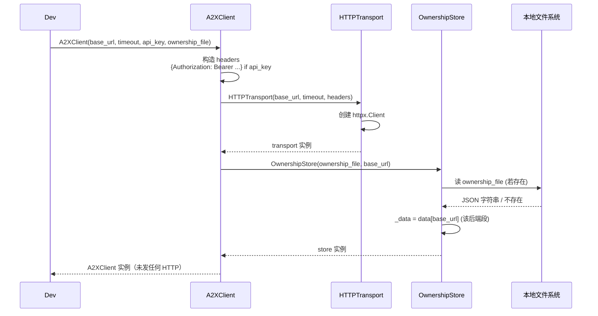

---

#### 3.3.2 `create_dataset`

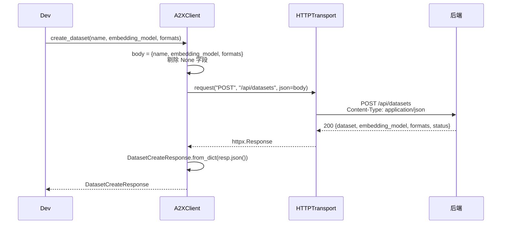

---

#### 3.3.3 `register_agent`

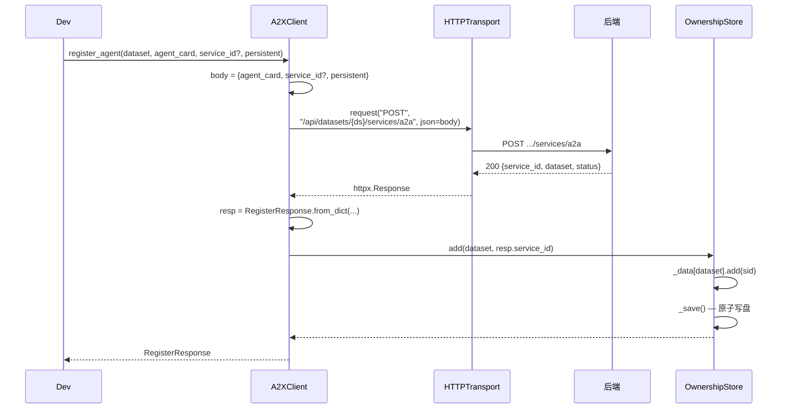

---

#### 3.3.4 `update_agent`

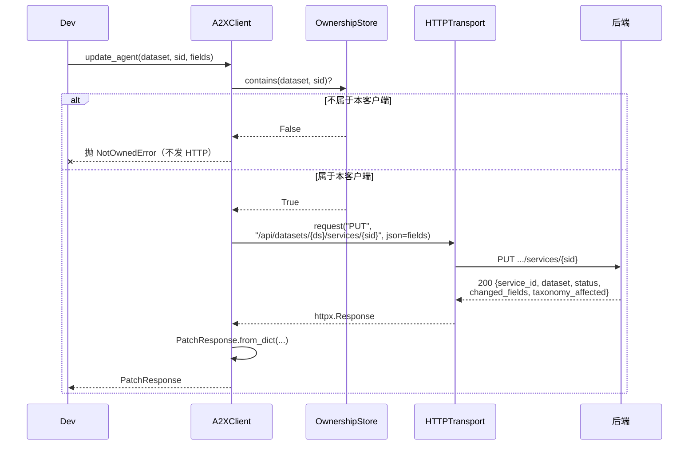

---

#### 3.3.5 `set_team_count`

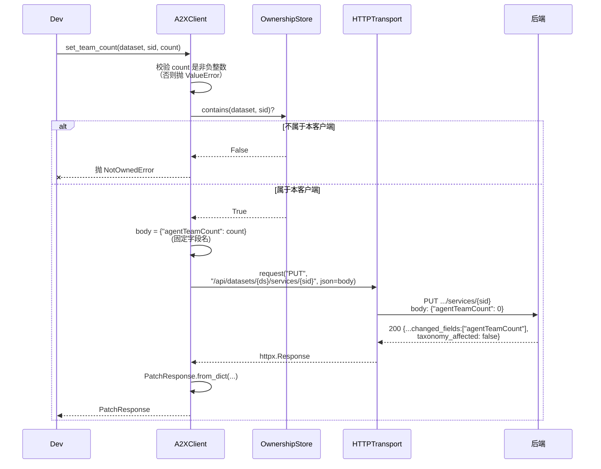

---

#### 3.3.6 `list_agents`

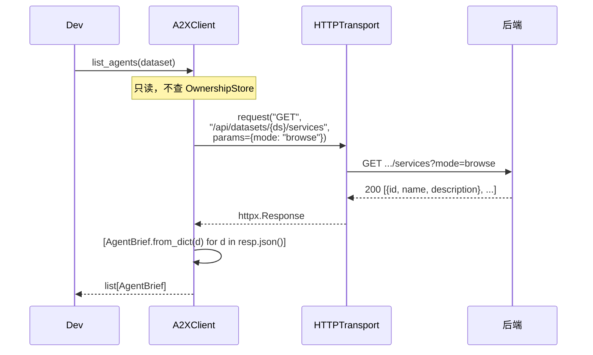

---

#### 3.3.7 `get_agent`

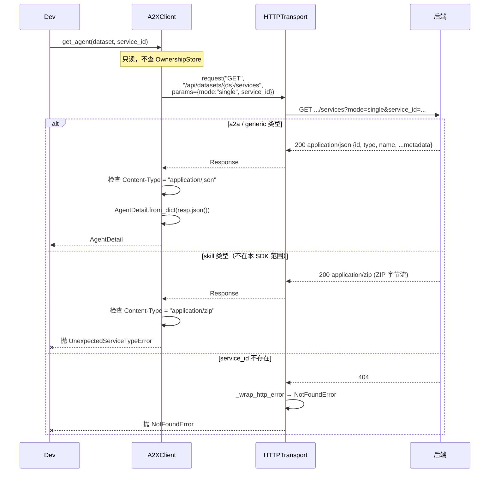

---

#### 3.3.8 `deregister_agent`

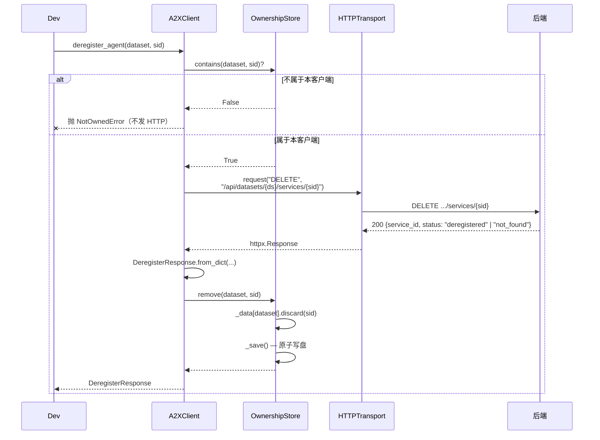

> **注**：后端 `status:"not_found"` 仍走成功路径（200），SDK 也会从 `_owned` 移除，保持本地与后端一致。

---

#### 3.3.9 `delete_dataset`

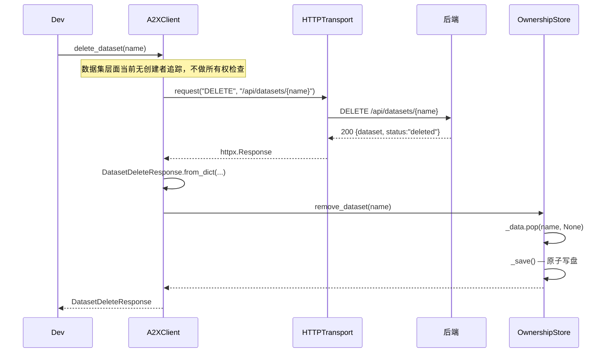

---

## 4. 后端一致性核对表

下表逐项比对 SDK 设计与后端实际实现（`src/backend/routers/dataset.py` + `src/register/service.py` + `src/register/models.py` + `docs/backend_api.md`）。

| SDK 方法 | 后端端点 | 已实现? | 请求格式一致? | 响应模型一致? | 备注 |
|----------|----------|:------:|:------------:|:------------:|------|
| `create_dataset` | `POST /api/datasets` | ✅ | ✅ 含 `formats` 字段（Agent Team 默认 `{"a2a":"v0.0"}`） | ✅ 响应含 `formats` | — |
| `register_agent` | `POST /api/datasets/{ds}/services/a2a` | ✅ | ✅ body `agent_card` dict 透传；不使用 `agent_card_url` | ✅ `{service_id, dataset, status}` | 成功后加入 `_owned` + 写盘 |
| `update_agent` | **`PUT /api/datasets/{ds}/services/{sid}`** | ✅（新增） | ✅ body 为 `fields` dict 直接透传 | ✅ `{service_id, dataset, status, changed_fields, taxonomy_affected}` | **部分字段 upsert，不是全量覆盖** |
| `set_team_count` | 同上（复用 PUT） | ✅ | ✅ body `{"agentTeamCount": <int>}` | ✅ 同上 | 依赖 `AgentCard.ConfigDict(extra="allow")` 接受自定义字段 |
| `list_agents` | `GET /api/datasets/{ds}/services?mode=browse` | ✅ | ✅ | ✅ `list[{id,name,description}]` | 空/不存在 → `[]` |
| `get_agent` | `GET .../services?mode=single&service_id=...` | ✅ | ✅ | ⚠️ a2a 返回 JSON，skill 返回 ZIP → SDK 按 `Content-Type` 分支 | 404 当 sid 不存在 |
| `deregister_agent` | `DELETE /api/datasets/{ds}/services/{sid}` | ✅ | ✅ 无 body | ⚠️ "not_found" 返回 **200**；`user_config` 来源 → 400 | 所有权检查 + 成功后从 `_owned` 移除 + 写盘 |
| `delete_dataset` | `DELETE /api/datasets/{ds}` | ✅ | ✅ | ✅ `{dataset, status:"deleted"}` | 副作用：清空 `_owned[ds]` + 写盘 |

**结论**：8 个会发 HTTP 的 method 与后端端点一一对应，全部已在后端实现。关键的新端点 `PUT .../services/{sid}`（部分字段更新）支撑了 `update_agent` 和 `set_team_count` 两个使用场景。

---

## 5. 扩展预留

- **register-config 管理**：后端新增 `GET/POST /api/datasets/{ds}/register-config` 可管理允许格式。如需支持，在 SDK 加 `get_register_config(ds)` / `set_register_config(ds, formats)`（同步 + 异步双份）
- **其他端点**：generic 服务注册、skill 上传、模糊检索（`POST /api/search`）、构建（`build.*`）、SSE/WebSocket — 按相同模式扩展，每个方法同时加到 `A2XClient` 和 `AsyncA2XClient`
